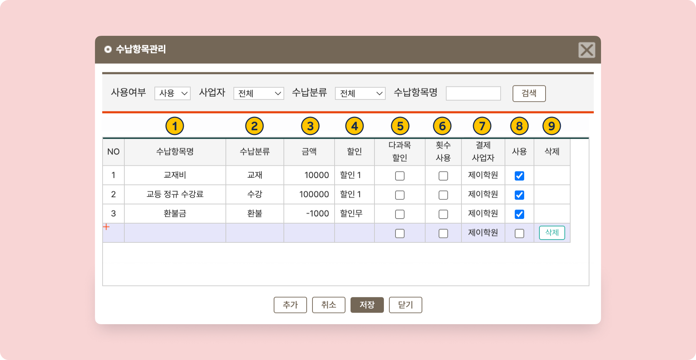
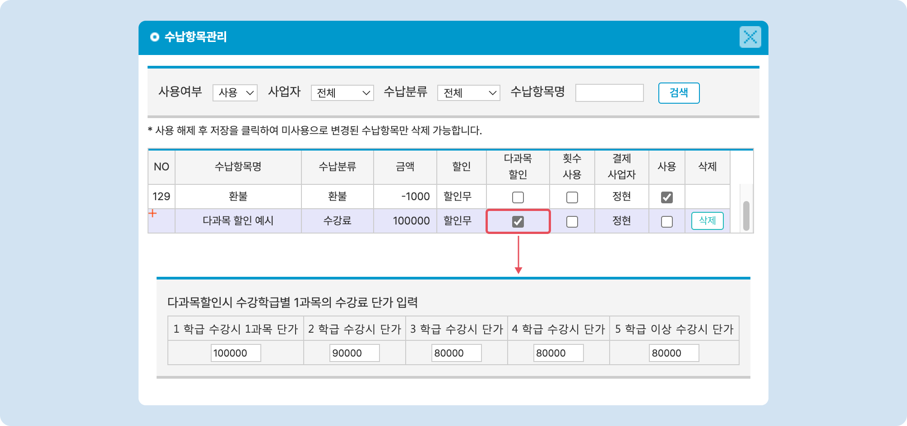

# 수납 항목 관리

 [학급 공통 정보 설정](./)

수업종류와 수강그룹을 이용해 학급을 범주화 할 수 있어요.

수납을 위한 수강료를 만들고 관리할 수 있어요. 학급에 추가하거나 개별 학생에게 추가하여 수납을 진행할 수 있습니다.

## 수납 항목 만들기

 버튼을 눌러 관리 팝업을 열고,  버튼을 눌러 입력 준비 상태로 전환합니다.

<figure><figcaption>
수납 항목 관리 팝업
</figcaption></figure>

### **입력 항목 상세**

1. **수납항목명**: 수납 항목의 이름을 지정합니다. 이름만으로 명목을 확인 할 수 있도록 만드는 것을 권장드려요.
2. **수납분류**: 수납항목의 범주를 지정합니다. 수납 분류가 동일한 값은 별도로 모아서 볼 수 있습니다.
3. **금액**: 수납 받을 금액을 정수로 입력합니다.
   * 음수값 생성을 이용해 환불 또는 이월 처리에 활용할 수 있습니다.
4. **할인**: 학생의 어떤 할인사유를 해당 수납항목에 적용 시킬지를 선택합니다.
   * **할인 무**: 수납 항목에 할인이 적용되지 않습니다.
   * **할인 1/2/3**: **학생관리: 신상정보**의 **할인사유: 할인1/2/3** 각각에 지정된 할인 옵션을 적용합니다.
   * **할인 적용 방법**: [discount.md](../../payments/tuition/discount.md "mention")
5.  **다과목 할인**: 학생이 수강 중인 학급의 수에 따라 수강료를 차등 적용할 수 있습니다.&#x20;

    * 체크 버튼을 누르면 아래에 입력 필드가 활성화 됩니다

    <figure><figcaption>
다과목 할인 설정
</figcaption></figure>
6. **횟수 사용**: 항목 체크 시 회차 수강료를 사용할 수 있습니다.&#x20;
   * 상세 보기: [session.md](../../payments/tuition/session.md "mention")
7. **결제사업자**: 여러 사업자가 등록되어 있는 경우 해당 수납 항목의 결제 사업자를 지정합니다.&#x20;
8. **사용**: 수납항목의 사용 여부를 지정합니다. 체크 해제 시 수납 항목이 숨겨집니다.

## 수납 항목 정보 수정하기

개별 수납 항목을 선택해 원하는 정보를 수정 후 \[**저장**] 버튼을 누르면 변경사항이 적용됩니다.


변경 사항은 생성된 수납 항목에 소급 적용되지 않아요.


## **수납 항목 삭제하기**


<mark style="color:blue;">**미사용**</mark>으로 전환 된 항목만 삭제할 수 있습니다.


<figure><figcaption>
수납 항목 삭제
</figcaption></figure>

1. :white\_check\_mark: **사용**을 체크 해제 하여 미사용 항목으로 전환 후 \[**저장**] 을 눌러 변경 사항을 적용합니다.
2. 상단 검색 조건에서 **사용 여부  → 미사용(또는 전체)**&#xC744; 눌러 미사용 수납 항목이 노출되는 상태로 전환하세요.
3. 개별 항목 우측에 있는 \[**삭제**] 버튼을 눌러 수납 항목을 삭제할 수 있어요.


학생에게 추가되어 있는 수납 항목을 삭제하면 이름이 비어있는 상태로 바뀝니다. 더 이상 사용하지 않는 항목만 삭제를 진행해주세요!

