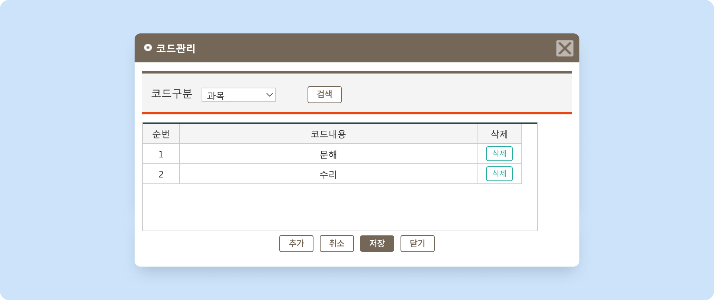

# 과목 관리

 [학급 공통 정보 설정](./)

## 과목 목록 관리

<figure><figcaption>
과목 관리 팝업
</figcaption></figure>

 버튼을 눌러 설정 팝업을 호출합니다.

1. **과목 추가하기**: 를 눌러 강의실명 입력 후 을 눌러주세요.
   * 순번은 저장 시 과목명의 오름차순(숫자 → 영문 → 한글)으로 자동 부여돼요.
2. **등록된 과목 수정**: 저장된 과목의 이름을 눌러 값을 수정 후  버튼을 누르면 변경사항이 적용됩니다.
3. **과목 삭제하기**: 개별 항목 우측에 있는  버튼을 이용합니다.
