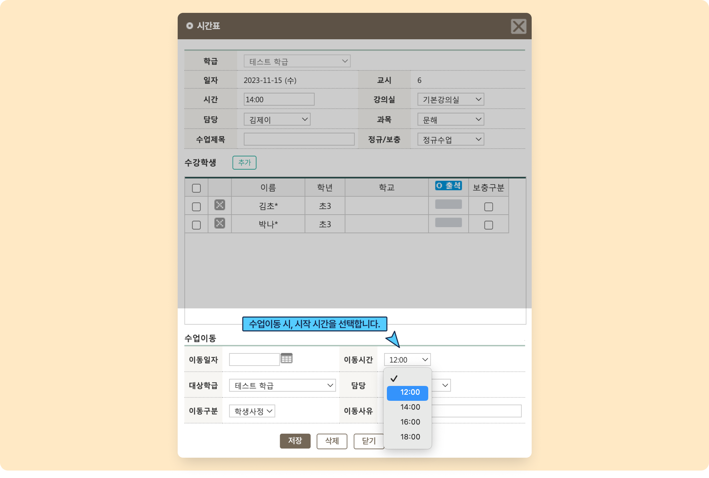

# 교시 시간 설정

 [학급 공통 정보 설정](./)

수업 시간 설정을 위한 수업 시작 시간 목록을 만듭니다.

## 수업 시작 시간 만들기

 버튼을 눌러 팝업을 호출합니다. 상세 과정은 아래의 인터랙티브 가이드를 확인하세요.




<mark style="color:red;">**수업 종료 시간**</mark>은 LMS 시스템 내에서 사용되지 않으며, 값을 비워두어도 저장할 수 있습니다.


## 수업 시작 시간의 사용

교시 시간 목록은 아래와 같이 사용됩니다.

### 1. 수업 계획 정보&#x20;

수업 계획 정보 추가 시 저장된 수업 시작 시간 목록 중 하나를 선택할 수 있어요.

<링크 추가> 수업계획정보 설정 바로가기

<figure><figcaption></figcaption></figure>

### 2. 수업 이동 시 시간 선택

전체시간표 메뉴에서 수업이동 시 이동 시간을 선택하는데 사용됩니다.

<링크 추가> 수업 이동 기능 바로가기 추가

<figure><figcaption></figcaption></figure>
