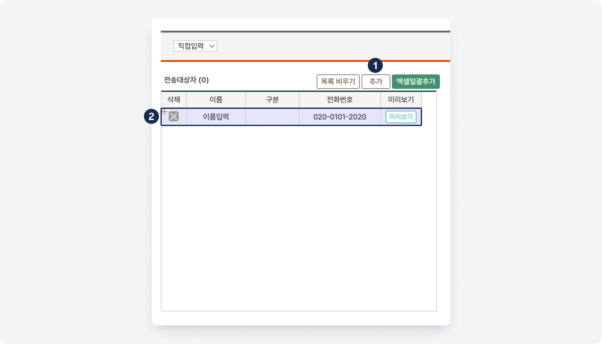
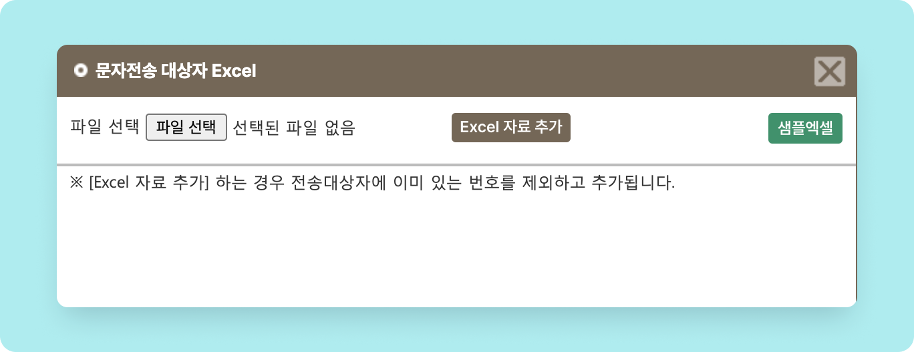
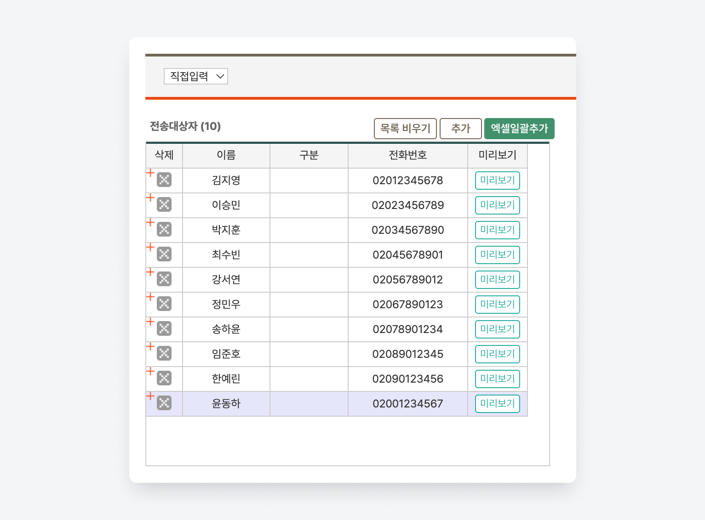

# 문자 보내기

***

상위 항목: [문자 기능↗](./)

 왼쪽 사이드 메뉴 → **문자보내기**

***


**문자 발송 전 확인**

문자를 발송하기 위해서는 **포인트 충전**과 **발신번호 사전 등록**이 필요합니다.


## 저장된 연락처 이용

###  전송 대상자 선택

<figure><figcaption>
문자 보내기: 전송 대상자 선택
</figcaption></figure>

1. 검색 필드에서 **발송 유형**을 선택합니다.
   * 발송 유형에 따라 세부 검색 조건은 변경 될 수 있어요.
2. 세부 조건을 지정한 후  버튼을 누르면 **전송 대상자 선택** 목록이 나타납니다.&#x20;
3. 체크 박스를 눌러 학생 또는 학부모를 선택하세요.
4. &#x20;➡️ 버튼을 누르면 우측의 **전송대상자** 목록으로 이동시킬 수 있어요.
   *  문자의 내용이 작성 후 보낼 문자를 미리 확인하실 수 있습니다.
   *  추가 되어있는 전송대상자 목록을 모두 비웁니다.

###  문자 내용 작성

전송대상자에게 보낼 문자 내용을 작성합니다. 메시지 내용을 **직접 작성**하거나 **저장메시지**를 이용할 수 있습니다.

#### 1) 직접 작성하기

<figure><figcaption>
문자 메시지: 직접작성
</figcaption></figure>

1. 보낼 내용을 작성합니다. 내용이 80 byte (한글 40자)가 넘어가면 LMS로 자동 변경됩니다.
2. 작성 시 미리 설정 된 **\[치환값]**&#xC744; 이용할 수 있습니다
   * 버튼을 클릭하면 작성 내용에 치환값이 추가됩니다.
3. : 이미지를 추가합니다. 이미지를 추가하면 MMS로 전환되며 발송 금액이 달라지니 주의하세요!
4. : 작성 중인 내용이 모두 지워집니다.&#x20;


**치환값**

\[내용]으로 미리 설정된 값으로 학생 정보에 따라 다른 내용을 발송합니다. 문자를 보내는 메뉴에 따라 사용할 수 있는 치환값은 다를 수 있습니다. 사용할 수 있는 치환값에 대한 정보는 각 메뉴에서 볼 수 있습니다.


#### 2) 저장메시지 사용하기

미리 저장된 메시지 템플릿을 가져와 문자 내용을 작성할 수 있어요.&#x20;


저장 메시지 등록 방법: [templates.md](templates.md "mention")


<figure><figcaption>
저장 메시지 사용
</figcaption></figure>

1. 문자 입력 필드 왼쪽의 저장 메시지 목록에서 제목을 선택하면 자동으로 입력 필드가 채워집니다.&#x20;
2. 필요한 경우 직접 내용을 수정하여 사용할 수 있어요.
   * 을 누르기 전까지 저장된 메시지는 수정되지 않습니다.

## 저장되지 않은 연락처로 발송

발송 대상 유형의 **직접입력**을 선택하면 연락처를 직접 입력하거나 엑셀 파일을 업로드 하여 문자를 발송할 수 있어요.


발송 대상 유형을 '**직접 입력**'으로 선택하면 기존 전송 대상자에 추가된 연락처는 그대로 남아있어요.

이를 이용해 시스템 내에 정보가 존재하는 연락처와 존재하지 않는 연락처에 동시에 문자를 보낼 수 있어요.


#### 1) 직접 입력해 추가하기

<figure><figcaption></figcaption></figure>

1.  버튼을 눌러 입력행을 추가합니다.
2. 이름 및 전화번호를 입력합니다.

#### 2) 엑셀 파일에서 불러오기

를 누르면 엑셀 파일을 내려받고 추가할 수 있는 팝업이 노출됩니다.  버튼을 누르면 연락처 일괄 추가에 필요한 파일을 내려받을 수 있어요.

<figure><figcaption>
엑셀 일괄 추가
</figcaption></figure>

엑셀을 이용해 이름과 연락처를 추가하고 저장한 뒤 을 이용해 업로드 후, 를 누르면 전송대상자에 추가 됩니다.

<figure><figcaption></figcaption></figure>

추가된 연락처를 이용해 문자를 발송하시면 됩니다!
