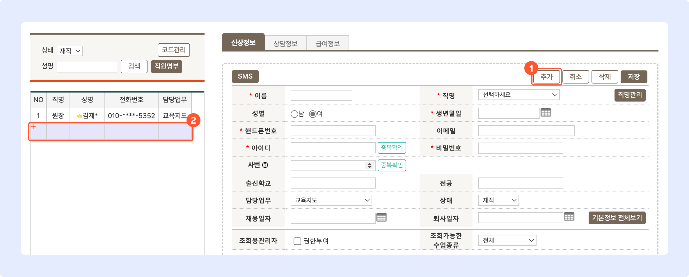
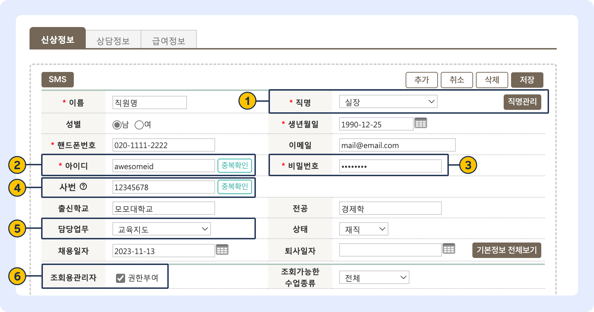
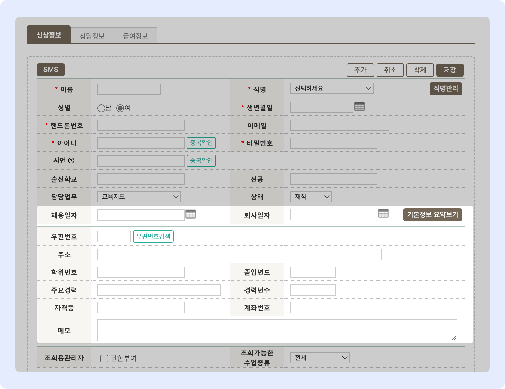
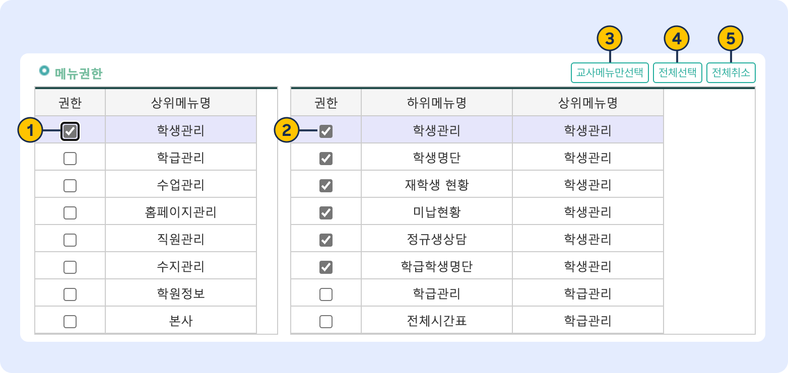

# 직원 추가와 권한 설정

 관리메뉴 → 직원관리 → **직원목록**

## 1. 직원 계정 추가하기

 버튼을 눌러 입력 상태로 전환합니다.&#x20;

<figure><figcaption></figcaption></figure>

입력 상태가 되면 정보를 입력할 수 있어요. <mark style="color:red;">\*</mark> 는 필수 입력 항목입니다. 필수 입력 항목을 채워넣으면 저장이 가능해요.

### 입력 항목 상세

<figure><figcaption></figcaption></figure>

1. **직명관리**: 기본 직명 외의 다른 값을 사용하고 싶다면 우측에 위치한  버튼을 눌러 목록을 수정할 수 있어요.
2. **아이디**: 입력 후 반드시 을 진행해 주세요. 6\~12자 영문, 숫자 조합으로 만들 수 있습니다.
3. **비밀번호:** 영문대소문자 , 숫자 , 특수문자 중 3가지 이상을 조합해야 합니다.
4. **사번**: 8자리 숫자로만 입력할 수 있어요. &#x20;
5. **담당업무**&#x20;
   * 수업을 진행하는 직원(또는 강사)는 교육지도를 선택해주세요.&#x20;
   * 교육지도가 선택되어 있어야만 수업 관련 메뉴에서 담당을 선택하는 목록에 나타납니다.
6. **조회용관리자**
   * 모든 학급 및 학생을 조회할 수 있는 권한을 부여합니다.&#x20;
   * 해당 권한이 없으면 본인이 담당하는 학급과 학생만 볼 수 있습니다.

## 2. 부가 정보 입력 

퇴사일자 오른쪽의 를 누르면 입력란이 확장되고 부가 정보를 입력할 수 있어요. 를 누르면 부가 정보 입력란을 숨깁니다.

<figure><figcaption></figcaption></figure>

## 3. 권한 설정&#x20;

시스템 사용 권한과 알림 문자 수신 여부를 설정할 수 있어요. 권한 부여는 **최초 가입 계정**(👑 으로 표시)만 가능합니다.

### 3-A 메뉴 권한

업무 범위에 따라 개별 메뉴의 접근 권한을 부여할 수 있어요. 직원은 허용된 메뉴에만 접근이 가능합니다.

<figure><figcaption></figcaption></figure>

1. 상위메뉴에 포함 된 하위메뉴를 모두 선택하거나 해제합니다.
2. 하위메뉴(개별 접근 가능한 메뉴)에 대한 접근 권한을 부여/해제 합니다.
3. : 강사가 자주 사용하는 메뉴를 자동 선택합니다.
4. : 전체 메뉴의 접근 권한을 부여합니다.
5. : 체크박스 선택을 모두 해제합니다.

### 3-B 시스템 권한

시스템의 주요 기능에 대한 권한을 부여할 수 있습니다.

<table><thead><tr><th width="225">권한</th><th>동작</th><th data-hidden></th></tr></thead><tbody><tr><td>업무일지 상위결재자</td><td>해당 직원의 업무일지 상위 결재자를 지정합니다.</td><td></td></tr><tr><td>기본정보 저장권한</td><td>
LMS 시스템 내 데이터에 대한 추가, 수정, 삭제 권한이 부여됩니다. 

<strong>수업 결과 기록</strong>은 기본 정보 저장 권한이 없어도 가능해요.
</td><td></td></tr><tr><td>경영정보 열람권한</td><td>경영정보 메뉴 접근 권한을 부여합니다. 권한이 있는 직원에게만 메뉴가 노출됩니다.</td><td></td></tr><tr><td>직원급여 및 상담권한</td><td>직원목록 내의 상담정보 및 급여정보 탭의 접근 권한을 지정합니다. 권한이 없으면 상담정보, 급여정보 탭이 노출되지 않습니다.</td><td></td></tr><tr><td>사용료 결제 권한</td><td>권한 부여 시 <strong>포인트 충전</strong>과 <strong>스마트 출결기 로그인</strong>이 가능해요.</td><td></td></tr></tbody></table>

### 3-C 문자 수신 설정

시스템에서 보내는 안내 문자에 대한 수신 여부를 설정할 수 있어요.

<table><thead><tr><th width="225">권한</th><th>동작</th><th data-hidden></th></tr></thead><tbody><tr><td>직원 출/퇴근 문자수신</td><td>스마트 출결기를 이용한 직원의 출,퇴근 체크 시 문자 수신 여부</td><td></td></tr><tr><td>홈페이지 상담예약 문자수신</td><td>홈페이지 입학테스트 신청 시 알림 문자를 받습니다.</td><td></td></tr><tr><td>홈페이지 Q&#x26;A 문자수신</td><td>홈페이지 Q&#x26;A 게시판에 질문 작성 시 문자를 수신합니다.</td><td></td></tr></tbody></table>

## 4. 저장 및 수정

직원 정보가  완료 되면 아이디, 비밀번호를 이용해 로그인하고 LMS 시스템을 이용할 수 있어요.

### 직원 정보 수정

저장이 완료 된 직원을 선택해 정보를 수정 하고  버튼을 누르면 변경 내용이 갱신됩니다.
