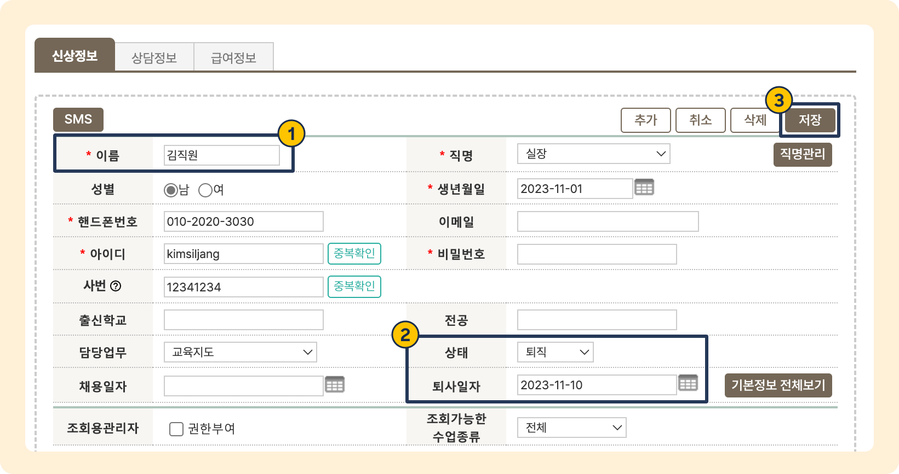
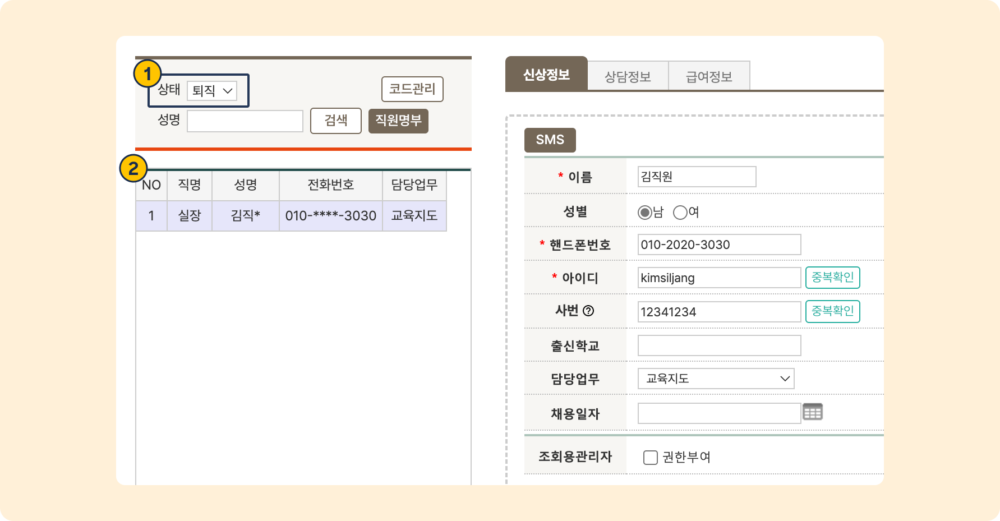

# 퇴직 처리하기

 [직원 추가](add.md)

 관리메뉴 → 직원관리 → **직원목록**

## 직원 퇴직 처리

직원을 퇴직 처리할 수 있습니다.&#x20;

<figure><figcaption></figcaption></figure>

1. 저장 된 직원 선택
2. 상태를 '퇴직'으로 변경 후 퇴사 일자를 지정&#x20;
3. 을 누르면 퇴직 상태로 변경됩니다.

## 퇴직 처리된 직원 조회

<figure><figcaption></figcaption></figure>

1. 왼쪽 상단에 위치한 '상태' 목록 중 퇴직을 선택합니다.
2. 퇴직처리 된 직원의 정보를 조회할 수 있습니다.

## 직원 삭제

직원의 정보를  할 수도 있으나 수업 이력 관리를 위해 권장하지 않습니다.
