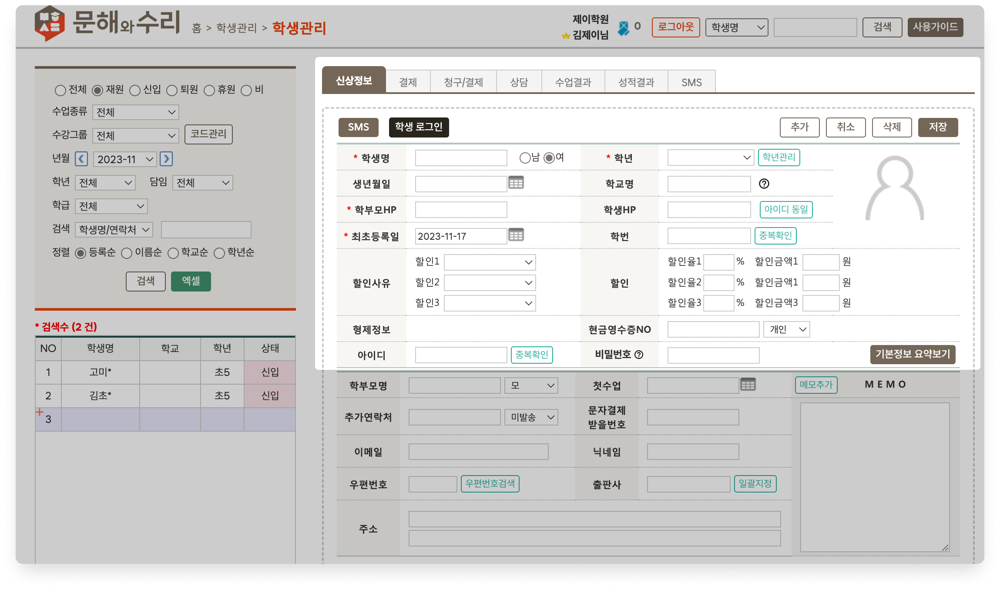
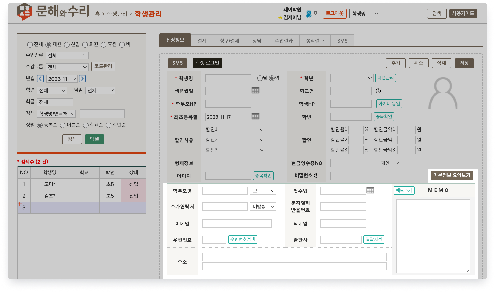

# 학생 정보 추가

↖ 상위항목: [학생 추가와 입반](broken-reference)

 기본메뉴 → 학생관리 → **학생관리**

 버튼을 눌러 입력 상태로 전환 합니다. 입력 상태가 되면 학생의 정보를 입력할 수 있어요.

***

## 기본 신상 정보

<figure><figcaption>
신상정보 - 기본
</figcaption></figure>

<table><thead><tr><th width="151">항목</th><th>내용</th><th>추가 정보</th></tr></thead><tbody><tr><td><strong>학생명</strong></td><td> 학생의 이름을 입력합니다.</td><td></td></tr><tr><td><strong>학년</strong></td><td> 학년을 선택합니다.</td><td>목록에 원하는 학년이 없는 경우 우측의 에서 학년을 추가할 수 있어요.</td></tr><tr><td><strong>생년월일</strong></td><td>생년월일을 선택합니다.</td><td></td></tr><tr><td><strong>학교명</strong></td><td>학생이 재학 중인 학교를 입력</td><td>학교명은 글상자에 직접 입력하거나 목록에서 선택하실 수 있습니다. 목록에 없는 학교명을 글상자에 입력하고 저장하시면 자동으로 목록에 추가됩니다.</td></tr><tr><td><strong>학부모HP</strong></td><td>학부모의 연락처를 입력합니다.</td><td></td></tr><tr><td><strong>학생HP</strong></td><td>학생의 연락처를 입력합니다. 연락처 입력 시 아이디가 자동으로 채워집니다.</td><td>: 학생의 전화번호를 아이디로 사용합니다.</td></tr><tr><td><strong>최초등록일</strong></td><td> 학생 정보가 추가된 날짜</td><td>등록 시점의 날짜가 기본값으로 선택됩니다.</td></tr><tr><td><strong>학번</strong></td><td>
출결번호 및 시험 고유번호로 사용되는 5자리 숫자를 입력합니다. 

학번은 중복되지 않아야 합니다.
</td><td>빈 값으로 저장하면 부모연락처 뒤4자리 + 순번이 채워집니다. 순번은 다른 학번과 중복되지 않도록 자동으로 값을 지정합니다.</td></tr><tr><td><strong>할인사유/할인</strong></td><td>할인 사유를 지정하고 할인을 적용합니다.</td><td>할인 적용 방법: (링크 추가 예정)</td></tr><tr><td><strong>형제정보</strong></td><td>부모님 연락처가 같은 경우 형제가 됩니다.</td><td></td></tr><tr><td><strong>현금영수증NO</strong></td><td>연동된 POS를 이용해 현금결제 처리 시, 현금영수증을 자동으로 발급하기 위한 번호를 입력합니다.</td><td>현금영수증 번호를 입력하지 않았을 때 자진발급 처리를 자동으로 하도록 설정할 수 있습니다. (링크 추가 예정)</td></tr><tr><td><strong>아이디</strong></td><td>연동 홈페이지의 로그인 아이디를 만듭니다. 학원 내에서 중복되지 않도록 해야합니다.</td><td>대소문자를 구분하며 6~12 자리로 입력할 수 있어요.</td></tr><tr><td><strong>비밀번호</strong></td><td>연동 홈페이지 로그인 비밀번호를 지정합니다.</td><td>비밀번호는 8자이상, 영문(대/소문자), 숫자, 특수문자를 포함해야 합니다. 한글이나 공백문자는 입력 할 수 없습니다.</td></tr></tbody></table>

##  추가 신상 정보

비밀번호 오른쪽에 있는  를 누르면 신상정보 영역이 아래로 확장되고 추가 정보를 입력할 수 있어요.

를 누르면 추가 정보를 가릴 수 있습니다.  최종 선택 값은 쿠키에 저장됩니다.

<figure><figcaption></figcaption></figure>

<table><thead><tr><th width="175.33333333333331">항목</th><th>내용</th><th>추가 정보</th></tr></thead><tbody><tr><td><strong>학부모명</strong></td><td>학부모의 이름을 저장합니다.</td><td></td></tr><tr><td><strong>첫수업</strong></td><td>학생의 첫 수업일을 기록합니다.</td><td></td></tr><tr><td><strong>추가연락처</strong></td><td>기본정보에 등록된 학부모 연락처 외에 추가로 필요한 연락처를 저장합니다.</td><td><strong>발송:</strong> 추가 연락처도 문자 발송에 사용</td></tr><tr><td><strong>문자결제 받을번호</strong></td><td>등록된 학부모 연락처가 아닌 다른 연락처로 결제 알림톡을 보낼 수 있어요.</td><td></td></tr><tr><td><strong>이메일</strong></td><td>학생의 이메일 주소</td><td></td></tr><tr><td><strong>닉네임</strong></td><td>학원 내에서 별도의 닉네임을 사용할 경우 입력</td><td></td></tr><tr><td><strong>우편번호</strong></td><td>우편번호</td><td></td></tr><tr><td><strong>출판사</strong></td><td>내신 교과서 출판사 정보</td><td></td></tr><tr><td><strong>주소</strong></td><td>학생의 주소</td><td></td></tr><tr><td><strong>메모</strong></td><td>학생에 대한 메모를 기록할 수 있습니다.</td><td>를 이용하면 <strong>입력날짜/작성자</strong>를 기록할 수 있습니다.</td></tr></tbody></table>

필요한 정보가 모두 입력되었다면 을 눌러 학생 추가를 완료 합니다. 학급 수강 정보가 없으면 비원생으로 등록됩니다.&#x20;

## 기타 기능 버튼

: 선택한 학생 및 학부모를 대상으로 문자를 보낼 수 있어요.

: 학생의 아이디를 이용해 연동 홈페이지에 접속합니다. 학생의 아이디와 비밀번호가 생성되어 있어야 합니다.

