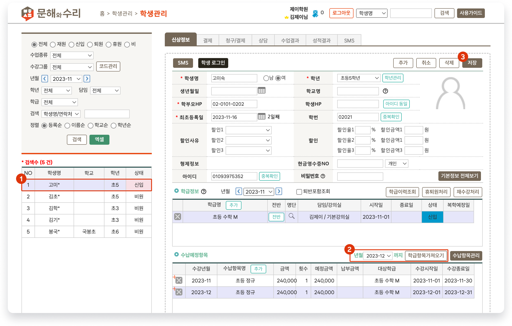

# 수납 항목 가져오기

↖ 상위항목: [학생 추가와 입반](broken-reference)

 기본메뉴 → 학생관리 → 학생관리

## 학급 수납 항목 가져오기

학생의 입반이 완료 되면 학급에 지정되어 있는 수납 항목을 가져올 수 있습니다. 가져온 수납 항목을 이용해 수납을 진행할 수 있어요.

<figure><figcaption>
학급 수납 항목 가져오기
</figcaption></figure>

1. 수납 항목을 추가할 학생을 선택합니다.&#x20;
   * 학급 수납 항목을 가져오기 위해서는 수강 중인 학급이 있어야 하고 학급에 [수납항목이 추가](../class-schedule/add-tuition.md)되어 있어야 합니다.
2. 수납 항목을 가져올 년월을 선택하고 를 눌러 수납예정항목을 추가합니다. 최대 3개월 분의 수납항목을 한 번에 가져올 수 있습니다.
   * 수강 시작일이 현재 년월 이후라면 학급정보 우측의 년월을 수강 시작년월에 맞게 변경해줍니다.
   * **예정금액**(실제 수납할 금액)을 변경할 수 있습니다. (결제 전이라면 언제든 수정 가능)
3. 수납예정항목을 확인 후  버튼을 눌러 변경 사항을 저장합니다.


수납 예정 항목이 추가 되면  탭으로 이동하여 결제를 진행할 수 있어요.

* 상세보기: [수강료 수납하기↗](../../payments/receiving/action.md)


## 개별 수납 항목 가져오기

