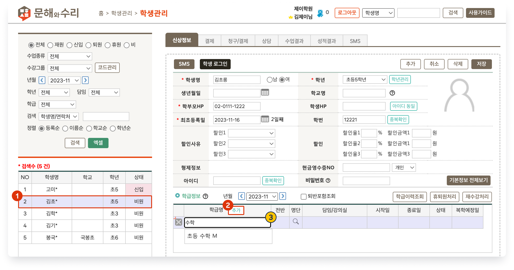

# 수강 학급 추가

↖ 상위항목: [학생 추가와 입반](broken-reference)

 기본메뉴 → 학생관리 → 학생관리

## 학생을 학급에 입반

###  학생 및 학급 선택

<figure><figcaption></figcaption></figure>

1. 입반을 원하는 학생을 선택합니다.
2. 학급명 우측의  버튼을 누르면 입력행이 추가됩니다.
3. 수강을 원하는 학급을 선택합니다. 목록에서 원하는 학급을 선택하거나 학급명에 포함된 글자를 입력하여 검색할 수 있어요

###  시작일 및 종료일 지정

<figure><figcaption></figcaption></figure>

4. **시작일**  및 **종료일**을 지정합니다. 종료일을 입력하지 않으면 학급이 종료되기 전까지 계속 수강을 하는 것입니다.
   * 학급을 선택하면 시작일은 자동 입력 됩니다. (수정 가능)
     * 학급 시작일이 오늘 이후인 경우 시작일, 오늘 이전인 경우 오늘 날짜가 자동으로 채워집니다.
   * 학급 시작일 이전의 날짜는 시작일로 선택할 수 없어요.
   * 학급 종료일 이후의 날짜를 종료일로 선택할 수 없어요.
5. &#x20; 동시에 여러 학급에 입반이 가능해요.
6. 정보 입력이 완료  버튼을 눌러 결과를 저장합니다.
