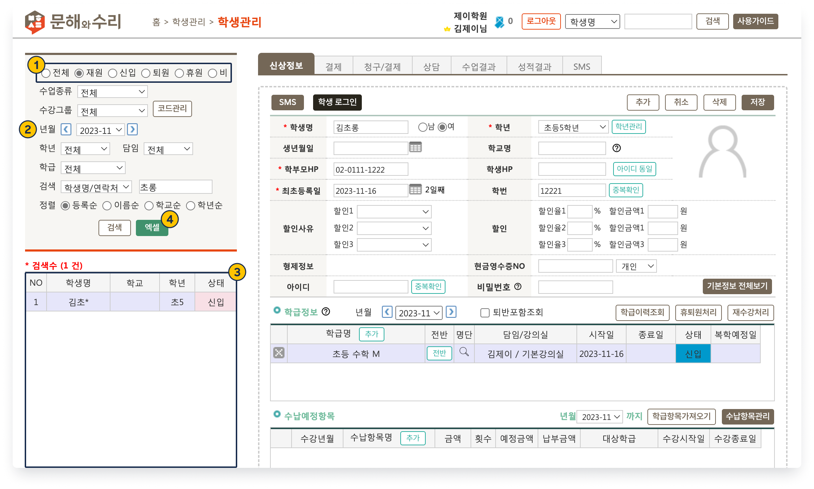
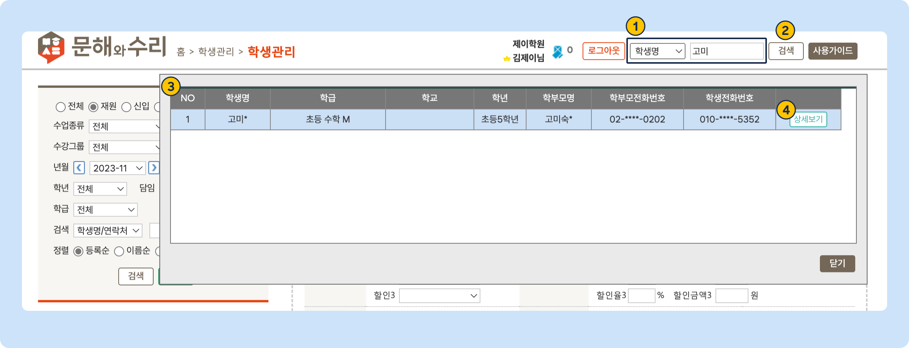
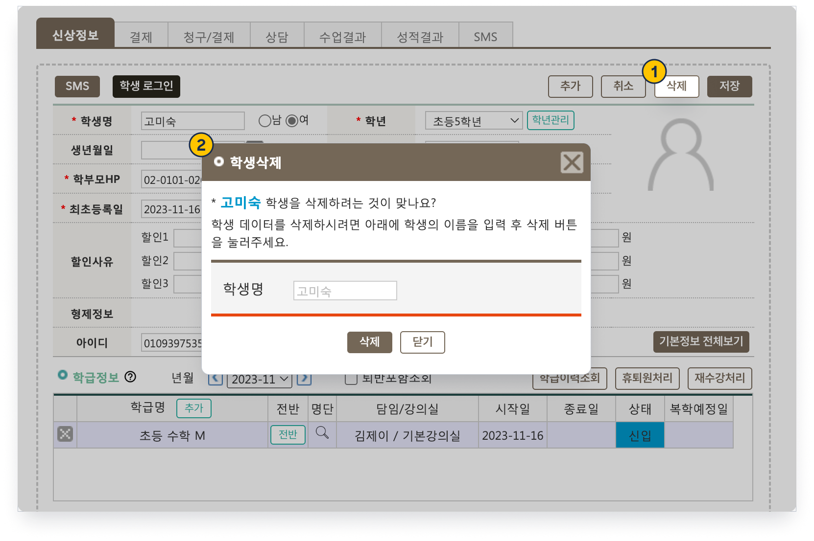
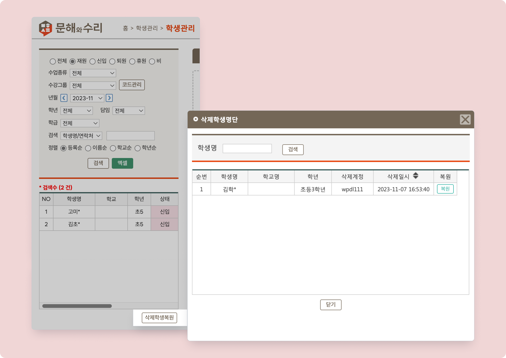

# 학생 검색과 정보 수정

↖ 상위항목: [학생 추가와 입반](broken-reference)

→ 선행기능: [학생 정보 추가](add.md)

 기본메뉴 → 학생관리 → **학생관리**

***

## 1. 학생 검색하기

### 학생관리 메뉴에서 검색

조건을 지정하고 학생을 검색하면 리스트에 이름이 나타납니다. 원하는 학생을 선택하면 정보를 조회할 수 있습니다.

<figure><figcaption>
학생 검색: 학생관리
</figcaption></figure>


학생의 상태에 대한 상세 설명은 (링크 추가 예정)을 참고하세요


1. **상태 선택**: 선택한 상태에 맞는 학생들만 조회합니다.
   * 전체: LMS 내 등록된 모든 학생 (상담생 제외)
   * 재원: 재원생, 신입생
   * 신입: 신입생, 신입예정
   * 퇴원: 퇴원생
   * 휴원: 휴원 처리가 된 학생
   * 비: 비원생
2. **년월**: 학생 조회 기준월을 변경할 수 있습니다. 기준 연월에 따라 학생의 상태는 자동으로 변경됩니다.
3. **검색 결과**: 검색 조건에 맞는 학생의 리스트가 나타납니다.
4. : 검색 된 학생의 정보를 엑셀 파일로 내려받습니다.

### 상단바 검색

상단 바 우측의 검색 필드를 이용해 학생을 검색할 수 있어요. 어떤 메뉴에 위치해 있어도 접근할 수 있습니다.

<figure><figcaption>
학생 검색: 상단바
</figcaption></figure>

1. **검색할 조건**을 선택하고 **검색어**를 입력합니다
   * 학생명, 학부모명, 학생/학부모 연락처, 학교명을 선택하여 검색할 수 있어요.
   *  연락처 검색의 경우 개인정보 보호를 위해 **마지막 4자리**만 이용해 검색할 수 있습니다.
2.  버튼 또는 **엔터**키를 눌러 검색을 진행합니다.
3. 조건에 맞는 학생의 목록이 아래에 나타납니다.
4. 오른쪽 끝의 를 누르면 **학생관리** 메뉴로 이동해 학생을 선택합니다.

## 2. 학생 정보 수정하기

학생을 검색하여 선택한 후 필요한 내용을 수정 또는 추가 입력 후  버튼을 눌러 변경사항을 적용합니다.

## 3. 학생 삭제하기

학생을 선택하고 우측 상단에 위치한 를 눌러 학생의 이름을 입력 후 삭제합니다.

 중복되는 학생이 있거나 해당 학생의 정보가 더이상 필요하지 않은 경우에만 삭제를 해주세요 .

<figure><figcaption>
학생 삭제
</figcaption></figure>

### **학생을 잘못 삭제 했어요**

학생리스트 우측 하단에 있는  을 눌러 복원을 진행할 수 있습니다.

<figure><figcaption>
삭제 학생 복원
</figcaption></figure>
