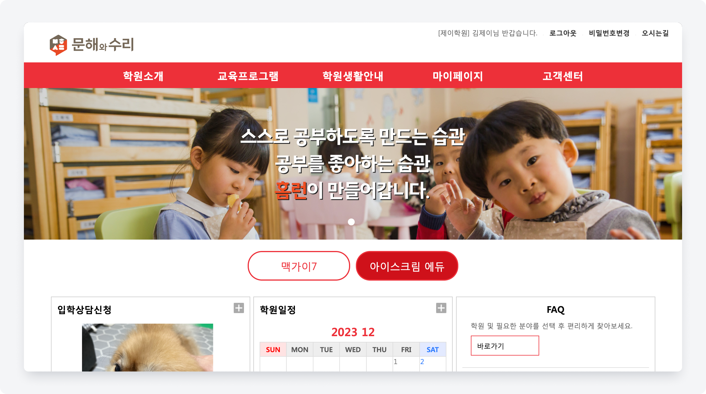

# 메인 이미지 설정

<figure><figcaption></figcaption></figure>

우측의 를 눌러 메인 이미지를 업로드할 수 있어요. 여러 장 업로드를 할 수 있으며, 홈페이지 상에서는 순서에 따라 자동으로 전환됩니다.

<figure><figcaption></figcaption></figure>

1. **순서**: 홈페이지 상에서 이미지가 표시 되는 순서를 정합니다. 홈페이지 진입 시 빠른 순서대로 노출되며 자동으로 전환 됩니다.
2. **명칭**: LMS 내에서 항목을 구분하기 위한 값입니다.
3. **연결 URL**:  각 이미지를 클릭 시 이동할 웹페이지의 주소를 입력합니다.
   * 웹페이지 주소는 `https://`를 포함한 전체 주소를 입력해야 합니다.
4. **팝업**: 입력된 연결 URL을 여는 방식을 선택합니다.
   * **팝업**: 새로운 탭 또는 창에서 URL이 열려요.
   * **자체**: 현재 탭에서 URL을 오픈합니다.
5. **PC 이미지**: 업로드 된 PC 이미지 파일의 이름이 표시됩니다.
6. **PC 업로드**: PC버전 웹에서 보여지는 이미지를 업로드 합니다.
   * **권장 이미지 사이즈 (px 기준)**
     * 1920(가로) x 450(세로), 1x
     * 3840(가로) x 900(세로), 2x
     * 이미지 용량이 클 경우 홈페이지를 불러오는 속도가 느려질 수 있으니 적절한 사이즈로 배치해주세요.
7. **Mobile 이미지**: 업로드 된 모바일 이미지 파일의 이름이 표시 됩니다
8. **Mobille 업로드**: 모바일 웹에서 보여지는 이미지를 업로드 합니다.&#x20;
   * 1:1 비율의 이미지를 업로드 해주세요.
