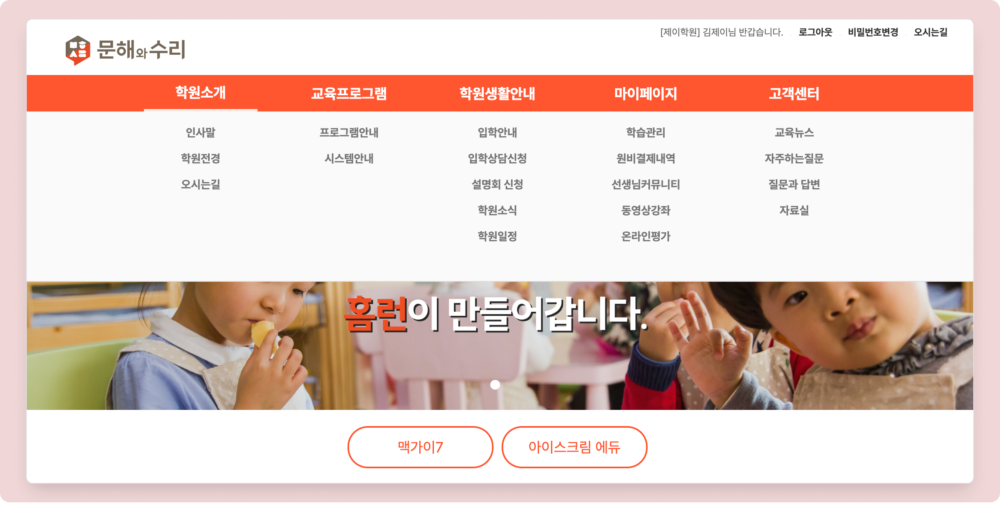

# 메뉴 배치하기

<figure><figcaption>
메뉴 오픈 화면
</figcaption></figure>

## 메뉴 추가하기

홈페이지 설정 메뉴의  메뉴를 이용합니다.

세부 항목의 상세한 설명은 아래의 내용을 참고해주세요.

1. <mark style="color:green;">**메뉴 및 인트로 설정**</mark> 우측의  버튼을 눌러 입력 상태로 전환합니다.
2. **대분류와 소분류**를 지정하여 메뉴의 배치를 정합니다.
   * 항목 순서는 시 대분류 **오름차순 → 소분류 오름차순**으로 자동 정렬됩니다.
   * 상세보기: [대분류와 소분류 규칙 →](menu.md#undefined-2)
3. **명칭**을 입력하고 메뉴 내에서 사용할 **프로그램**을 지정합니다.
   * 상세보기: [메뉴에서 사용 가능한 프로그램 →](menu.md#undefined-4)
4. [**구분**](menu.md#undefined-5) 항목은 자동으로 입력됩니다.
5. 메뉴 접근에 **로그인** 여부를 지정합니다.
6. 우측 최하단의 <mark style="color:blue;">**저장**</mark>을 누르면 변경 사항이 반영됩니다.

## 대분류와 소분류

숫자 값을 이용해 메뉴의 배치 및 위계를 정할 수 있습니다. 소분류 값을 비워두면 해당 메뉴는 숨김 처리 됩니다.

<figure><figcaption></figcaption></figure>

대분류 및 소분류는 아래와 같이 배치됩니다.  '**소분류 0'**&#xC740; 대분류 메뉴명으로 사용됩니다.

<figure><figcaption></figcaption></figure>


메뉴 구성 시 **대분류 6개**, **소분류 9개**를 넘지 않도록 만드는 것을 권장합니다.


## 명칭

홈페이지에 표시되는 메뉴의 이름을 지정합니다. 기본값으로 포함된 메뉴의 이름도 변경 가능하며, 연결된 기능는 별도의 이름을 따로 지정할 수 있어요

## 프로그램

메뉴에서 사용할 기능을 선택할 수 있어요.

<table><thead><tr><th width="176">프로그램명</th><th>사용 기능</th></tr></thead><tbody><tr><td><strong>URL Link</strong> </td><td>메뉴 진입 시 지정한 URL 주소로 이동할 수 있습니다. * URL Link 사용 시 &#x3C;구분>에 <strong><code>https://</code></strong> 를 포함한 전체 주소를 입력해야 합니다.</td></tr><tr><td><strong>갤러리_타입 1</strong></td><td>좌우로 넘기는 방식의 갤러리 화면을 제공합니다.</td></tr><tr><td><strong>갤러리_타입 2</strong></td><td>그리드뷰 방식의 갤러리 화면을 제공합니다. 썸네일 방식의 이미지 게시글을 작성할 수 있습니다.</td></tr><tr><td><strong>결제내역</strong></td><td>학생 별 결제가 완료된 항목을 볼 수 있습니다.</td></tr><tr><td><strong>공지사항/자료실</strong></td><td>공지사항 및 자료실 게시판을 사용할 수 있습니다. 각 게시판은 연결 되지 않고 별도로 사용할 수 있습니다.</td></tr><tr><td><strong>나의 수업만</strong></td><td><strong>학생</strong>으로 로그인 시 자신의 수업 목록을 확인할 수 있습니다.</td></tr><tr><td><strong>동영상 강의</strong></td><td>학생이 영상 강의를 볼 수 있는 페이지를 제공. LMS 내의 <strong>강의영상관리</strong> 메뉴와 연동되며 여러 개의 메뉴를 만들어도 동일한 페이지가 나타납니다.</td></tr><tr><td><strong>선생님 커뮤니티</strong></td><td>선생님이 담당 학생에게 공지 사항을 전달하거나 학생이 선생님에게 질문글을 작성할 수 있습니다</td></tr><tr><td><strong>설명회</strong></td><td>설명회 모집 페이지를 제공합니다.  설명회 세팅은 <strong>기본메뉴 → 홈페이지관리 → 설명회관리</strong> 에서 가능합니다.</td></tr><tr><td><strong>성적현황 학습결과</strong></td><td>(학생메뉴) <strong>주간시간표</strong>, <strong>수업 결과(월간)</strong>, <strong>시험 성적</strong>을 확인할 수 있습니다.</td></tr><tr><td><strong>신규생 상담신청</strong></td><td>
입학테스트 신청 페이지를 연결합니다.

해당 페이지에서 입학테스트 신청 시,  홈페이지 관리 → 입학상담 / 상담예약관리 내에서 확인할 수 있습니다.
</td></tr><tr><td><strong>오시는 길</strong></td><td>학원정보관리에 입력된 주소를 지도로 보여 줍니다. 회원가입 시 입력 된 <strong>주소</strong>가 변경 되었다면 별도의 변경 요청이 필요합니다. <strong>전화번호</strong>는 학원에서 직접 변경 가능하며, 변경 후 바로 적용 됩니다.</td></tr><tr><td><strong>온라인평가</strong></td><td>온라인 평가를 진행할 수 있는 페이지를 연결합니다.  * 온라인 평가 설정: 기본메뉴 > 수업관리 > <strong>시험관리</strong></td></tr><tr><td><strong>일정관리</strong></td><td>시스템과 연동하여 학원일정을 보여주는 페이지를 연결합니다. 접속 유형(학생 또는 직원)에 따라 보이는 일정이 달라요.</td></tr><tr><td><strong>자주하는 질문</strong></td><td>FAQ 게시판을 사용할 수 있습니다. * 기본메뉴 → 홈페이지관리 → <strong>FAQ/Q&#x26;A</strong> 내의 <strong>FAQ 관리</strong>에서 게시판의 내용을 관리할 수 있습니다.</td></tr><tr><td><strong>질문과 답변</strong></td><td>
Q&#x26;A 게시판을 연결 합니다.

기본메뉴 → 홈페이지관리 → FAQ/Q&#x26;A 메뉴의 <strong>Q&#x26;A 관리</strong>에서 페이지 내용을 관리할 수 있습니다.
</td></tr><tr><td><strong>주간시간표</strong></td><td>(학생메뉴) 표 형태로 주간 시간표를 확인할 수 있습니다.</td></tr><tr><td><strong>한페이지안내</strong></td><td> 해당 페이지 내에서 게시글을 작성하여 한 페이지로 보여줄 수 있습니다. 다른 메뉴에 한 페이지 안내를 추가로 지정하여도 별개로 동작합니다.</td></tr></tbody></table>

## 구분

개별 메뉴와 기능에 자동으로 부여되는 고유 코드입니다.

## 로그인 여부

메뉴 접근 시, 로그인 필요 여부를 지정할 수 있습니다.

* **`Y`**: 해당 메뉴 접근 시 로그인이 필요
* **`N`**: 로그인 없이 해당 메뉴를 이용할 수 있습니다.
