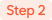

# 기본 설정

<figure><figcaption></figcaption></figure>

## 홈페이지 기본 색상

홈페이지의 메인 색상을 변경할 수 있습니다.&#x20;


**색상 변경이 적용 되는 요소**

메뉴바의 배경, 배너 버튼의 윤곽선, 내부 버튼의 색상, 인트로 카드에서 표시 되는 달력의 년월 텍스트


## 학원 홈페이지 설명

웹페이지에 대한 설명을 추가합니다 (30자 이내)

검색 엔진에 노출 되면 아래 이미지의 **'네이버 모바일 메인에서\~'**&#xC5D0; 해당하는 부분에 표시됩니다.

<figure><figcaption></figcaption></figure>

## 학원 Logo Image

홈페이지 상단에 표시 되는 학원 로고 이미지 파일을 업로드할 수 있어요.


**권장 이미지 사이즈**: 540 x 180 (가로 3 : 세로 1 비율)


## 네이버 메타 태그

네이버 검색 시 노출 우선 순위를 높일 수 있습니다. 아래의 적용 방법을 참고해주세요.&#x20;

\
네이버 [서치어드바이저](https://searchadvisor.naver.com/)↗로 이동하여 아래 쪽으로 조금 내려가면 보이는 <mark style="color:green;">**웹마스터 도구 사용하기**</mark> 버튼을 눌러주세요.

<figure><figcaption></figcaption></figure>

\
학원 홈페이지 주소를 입력하고 우측 끝에 있는 버튼을 누르면 사이트 소유확인이 진행됩니다.

<figure><figcaption></figcaption></figure>

\
🔘 **HTML 태그**를 누르고 아래의 메타 태그를 복사합니다.

<figure><figcaption></figcaption></figure>

\
**홈페이지 설정**으로 이동하여 복사한 메타 태그를 '**네이버 메타 태그**' 항목 에 붙여 넣고 변경 사항을 합니다.

<figure><figcaption></figcaption></figure>

저장 후 다시 네이버 웹마스터 도구 페이지로 돌아가  버튼을 누르면 메타 태그 등록이 완료 됩니다.
