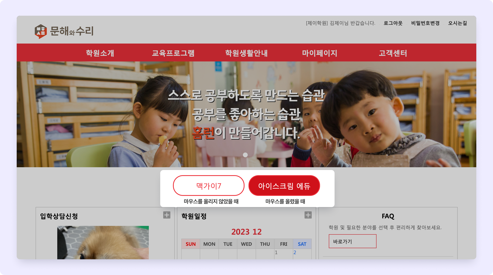

# 바로가기 버튼

<figure><figcaption></figcaption></figure>

## 버튼 추가하기

<figure><figcaption></figcaption></figure>

 우측의  버튼을 눌러 필요 항목 입력 후 변경 사항을 합니다.&#x20;

버튼의 색상은 홈페이지 기본 설정의 컬러 선택에 따라 달라져요.

### 추가 옵션 상세

<table><thead><tr><th width="119">항목</th><th>세부 내용</th></tr></thead><tbody><tr><td><strong>순서</strong></td><td>
바로가기 버튼의 배치 순서를 지정합니다. 숫자로 순서를 지정할 수 있습니다. 

데스크탑 웹 사용 시 가로 최대 5개, 모바일 페이지에서 가로 최대 2개까지 배치 됩니다.
</td></tr><tr><td><strong>명칭</strong></td><td>버튼에 표시 되는 텍스트를 입력합니다.</td></tr><tr><td><strong>연결 URL</strong></td><td>버튼을 눌렀을 때 이동할 URL 주소를 지정합니다. URL 주소는 반드시 <strong><code>https://</code></strong>를 포함해야 합니다.</td></tr><tr><td><strong>팝업</strong></td><td>연결된 URL 이 열리는 위치를 지정할 수 있습니다. - 자체: 현재 탭에서 연결된 URL 이 열립니다. - 팝업: 새로운 탭 또는 창으로 열립니다. (브라우저 설정에 따라 다름) </td></tr></tbody></table>
