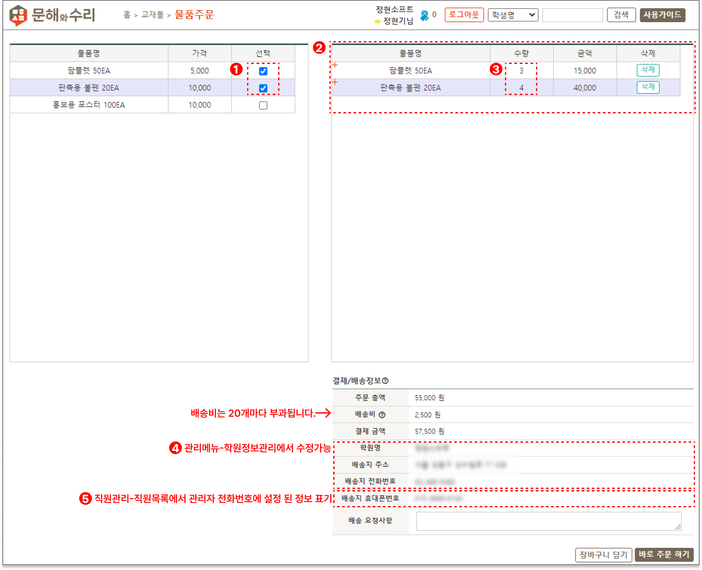
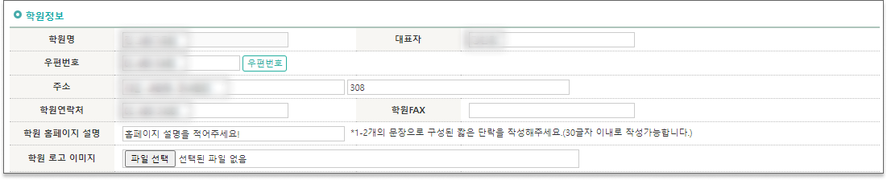

# 물품주문

<figure><figcaption>
물품주문
</figcaption></figure>

1. 물품을 선택하면 <mark style="background-color:purple;">2.</mark>의  주문목록에 바로 담깁니다.
2. 선택한 물품이 주문목록으로 나타납니다. <mark style="background-color:purple;">1.</mark>에서 선택을 해제하거나 우측의 삭제 버튼을 누르면 주문목록에서 물품이 삭제됩니다.
3. 주문할 물품의 수량을 수정할 수 있습니다.
4.  배송정보는 학원정보관리  메뉴에서 따로 수정할 수 있습니다.

    <figure><figcaption>
학원정보관리 - 학원정보 영역
</figcaption></figure>
5.  배송지 휴대폰번호는 학원의 **최고관리자**의 휴대폰 번호가 표기됩니다.\
    직원목록 메뉴에서 관리자의 휴대폰 번호를 수정하면 배송지 휴대폰번호를 변경할 수 있습니다.

    <figure><figcaption>
직원관리
</figcaption></figure>

