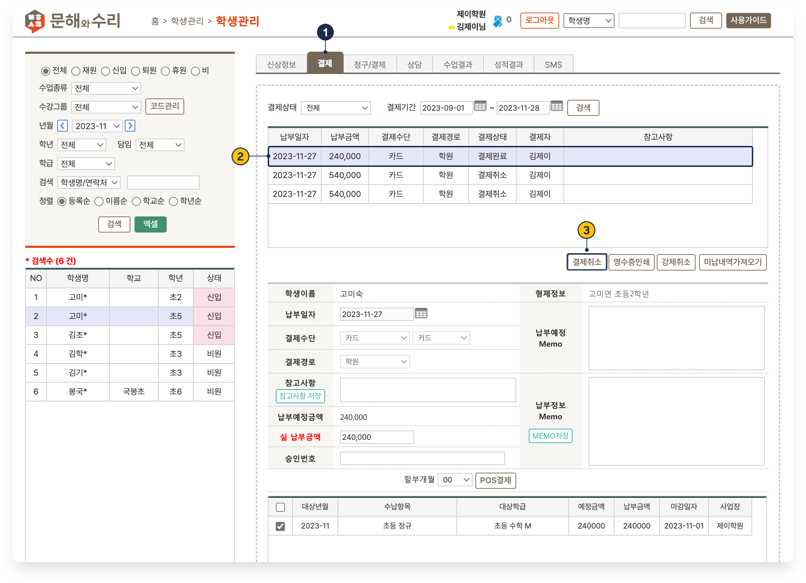

# 수납 취소하기

↖ 상위 항목: [수강료 수납](./)

→ 선행 기능: [수납하기](action.md)

 기본메뉴 → 학생관리 → **학생관리**

***

결제 완료(또는 대기) 건을 취소할 수 있습니다. 학생 선택 후

1.  **탭**으로 이동
2. 취소를 원하는 결제 건을 선택
3.  를 눌러 취소를 진행합니다. 는 취소가 가능한 건을 선택했을 때만 활성화 됩니다.

결제 수단에 따라 진행 과정에 차이가 있습니다. 취소가 완료 되면 '결제상태'가 <mark style="color:red;">**결제취소**</mark>로 변경되며 미납 건으로 돌아갑니다.  를 눌러 다시 결제를 진행할 수 있어요.

<figure><figcaption></figcaption></figure>

## 연동 단말기 결제 건

**카드POS**: 결제취소 시 결제를 진행한 카드가 필요합니다. 안내에 따라 카드를 넣고 취소를 진행합니다.


**키인취소:** 학부모님의 학원 방문이 어려운 경우 단말기를 이용해 결제 내역을 취소할 수 있습니다.&#x20;

결제 단말기의 **취소/정정** → 2.신용 취소를 선택하여 정보를 입력합니다.

취소에 필요한 정보

* **카드번호, 유효기간**: 고객을 통해 확인 필요
* **승인금액, 원승인일자, 승인번호**: 결제 목록에서 확인 가능
* <mark style="color:red;">**현대카드**</mark> 및 <mark style="color:red;">**하나카드**</mark>는 위의 방법으로 취소를 할 수 없어요.&#x20;


**현금영수증, 무통장영수증**: 결제취소 시 현금 영수증 발급도 자동 취소 됩니다. (결제일로 부터 3개월 이내인 건만 가능)

## 미연동 결제 건

연동 단말기를 통하지 않은 결제 건은  를 누르면 즉시 취소처리가 됩니다.

## 문자 결제 취소

문자 결제를 취소하는 방법은 (문자결제: 청구서 파기와 결제 취소↗) 의 내용을 참고해주세요.

## 강제 취소

결제 완료 건을 선택 후  를 누르면 연동 여부와 관계 없이 **LMS 시스템 상에서만** 취소 된 것으로 처리합니다.&#x20;

* 연동 결제 건 중 **카드POS**, **문자결제**는 강제취소 시 실제 결제가 취소 되지 않으므로 별도의 후처리가 필요합니다.
  * **카드POS**:  키인취소를 이용해 별도 취소를 해주셔야 합니다.
  * **문자결제**: 매니저 사이트에서 취소를 진행합니다. (매니저 사이트에서 결제 취소 하기↗)
* 을 이용해 처리된 결제 건은 결제취소와 강제취소 어느 것을 눌러도 최종 결과는 동일합니다.
