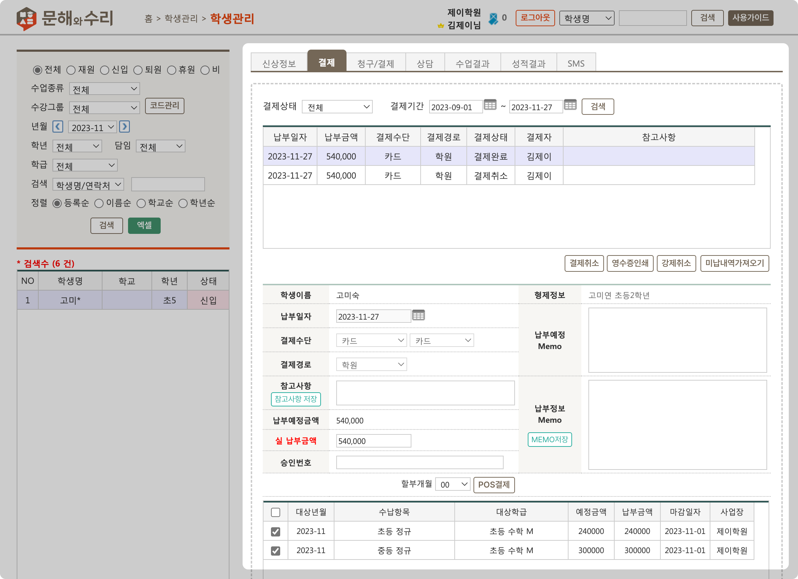
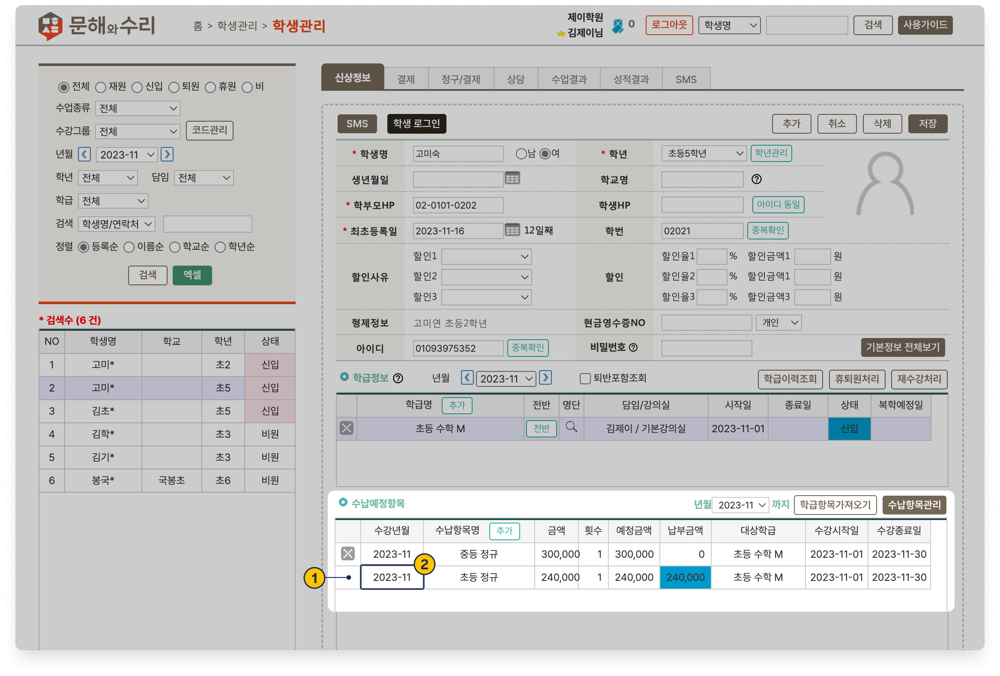

# 학생 수납 내역 조회

↖ 상위 항목: [수강료 수납](./)

 기본메뉴 → 학생관리 → **학생관리**

***

## 1. 결제 탭에서 보기

 탭에서 개별 결제 건을 눌러 세부 내역을 확인할 수 있어요.  결제 상태 및 기간을 지정하여 원하는 항목을 찾을 수 있습니다.

<figure><figcaption></figcaption></figure>

### 개별 열 항목 상세

<table><thead><tr><th width="173">항목명</th><th>내용</th></tr></thead><tbody><tr><td><strong>납부 일자</strong></td><td>결제가 진행 된 일자</td></tr><tr><td><strong>납부 금액</strong></td><td>해당 결제 건에서 납부한 총 금액</td></tr><tr><td><strong>결제 수단</strong></td><td>수납에 사용한 결제 수단</td></tr><tr><td><strong>결제 상태</strong></td><td>
결제 진행 상태를 표시합니다.
<ul><li><strong>결제완료</strong>: 결제가 완료 된 건</li><li><strong>결제취소</strong>: 결제 완료 후 취소(결제 취소 또는 강제 취소)가 진행 된 건</li><li>
<strong>결제대기</strong>: 결제 대기 상태인 항목
<ul><li>결제 선생 알림톡을 발송하고 결제가 완료 되지 않았을 </li><li>POS 결제 진행 과정에서 강제 중단 되었을 때</li></ul></li><li><strong>대기취소:</strong> 결제대기 상태인 항목을 취소</li></ul></td></tr><tr><td><strong>결제자</strong></td><td>수납 진행 시 접속했던 직원 정보</td></tr><tr><td><strong>참고사항</strong></td><td>결제 시 자동으로 기록되는 정보 및 결제 시 별도로 저장한 메모가 표시</td></tr></tbody></table>

## 2. 신상정보 탭: 수납예정항목

**신상정보 탭:&#x20;**<mark style="color:blue;">**수납예정항목**</mark> 에서는 **미납 항목**(월 조건과 관계없이 상시 노출)과 **이번 달에 결제가 완료된 항목**을 볼 수 있어요.

<figure><figcaption></figcaption></figure>

1. **결제가 완료** 된 항목은 삭제할 수 없어요.
   * 결제 취소 시 다시 미납 항목으로 변경되고 항목 삭제 및 예정 금액을 조정할 수 있습니다.
2. **수강년월**은 결제 완료 여부와 관계 없이 변경할 수 있습니다.

## \[참고] 결제 수단 상세 안내

<table><thead><tr><th width="178.33333333333331">결제 수단</th><th width="210">선택 결제 수단</th><th>처리 방법</th></tr></thead><tbody><tr><td><strong>현금</strong></td><td>현금</td><td>학원수납저장</td></tr><tr><td><strong>현금영수증</strong></td><td>현금</td><td>POS 결제를 이용해 현금영수증 발급</td></tr><tr><td><strong>카드POS</strong></td><td>카드</td><td>POS 결제 이용</td></tr><tr><td><strong>카드</strong></td><td>카드</td><td>학원수납저장</td></tr><tr><td><strong>문자결제</strong></td><td>-</td><td>결제선생 알림톡 결제 건</td></tr><tr><td><strong>가상계좌</strong></td><td>관계 없음</td><td>가상계좌 버튼 이용</td></tr><tr><td><strong>가상계좌직접</strong></td><td>가상계좌 - 가상계좌직접</td><td>학원수납저장</td></tr><tr><td><strong>무통장입금</strong></td><td>무통장입금</td><td>학원수납저장</td></tr><tr><td><strong>무통장영수증</strong></td><td>무통장입금</td><td>POS 결제를 통해 현금영수증 발급</td></tr><tr><td><strong>지역화폐</strong></td><td>지역화폐</td><td>학원수납저장</td></tr><tr><td><strong>CMS무통장</strong></td><td>CMS</td><td>CMS무통장</td></tr><tr><td><strong>CMS카드</strong></td><td>CMS</td><td>CMS카드</td></tr></tbody></table>
