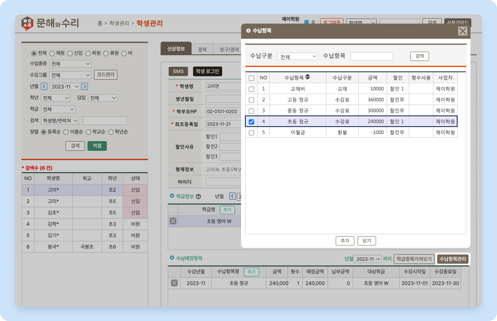
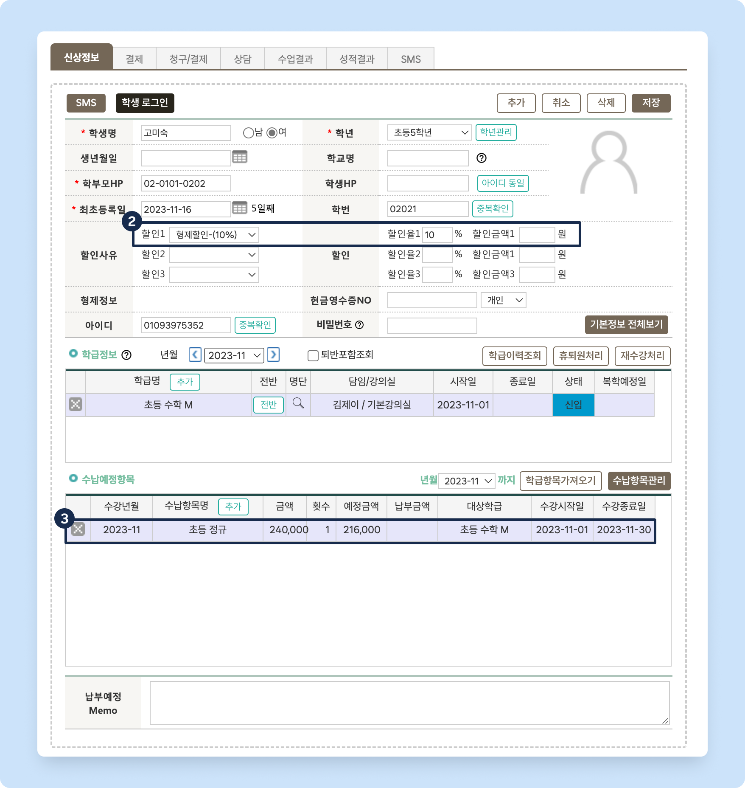

# 수강료 할인 적용하기

## 할인 사유 관리

할인 사유를 미리 만들어 수강료 할인을 적용할 수 있어요.

 기본메뉴 → 학생관리 → **학생관리**

<figure><figcaption>
코드관리: 할인사유
</figcaption></figure>

1. 학생관리 메뉴로 이동, 좌측 상단 검색 창의 를 눌러 팝업창을 호출합니다.
2. 코드구분 드랍다운 목록에서 **할인사유**를 선택합니다.
   * **새로운 할인 사유 추가**:  버튼을 눌러 코드내용(할인 사유명), 할인율(%), 할인금액을 입력하고  합니다.&#x20;
     * 할인율, 할인 금액 중 하나만 입력하거나 동시에 사용할 수 있습니다.
       * 동시 사용 시 할인금액 차감 후 할인율을 적용합니다.
   * **입력된 할인 사유 수정**: 기존에 입력 된 내용을 변경 후 
   * **삭제**:  각 항목 오른쪽의  버튼을 눌러 할인 사유를 제거할 수 있습니다.
     *  할인 사유가 삭제되면 해당 할인 사유를 사용하는 학생의 할인 적용이 즉시 해제 됩니다.

## 학생에 할인 사유 적용하기

&#x20;

.svg>)에서 할인을 적용 받을 수납 항목에 할인 번호를 지정합니다. 선택한 할인 번호는 개별 학생의 할인 사유와 연결됩니다.

&#x20;

학생의 ‘**신상정보 - 할인사유**’ 항목에서 적용할 할인 사유를 선택합니다. 아래의 경우 **할인1**이 적용된 수납 항목을 학생에게 추가할 때 10% 할인이 적용될거에요.

<figure><figcaption></figcaption></figure>

&#x20;

‘**할인1**’로 매칭 된 수납 항목을 추가했습니다. **10% 할인**이 적용 된 것을 확인할 수 있어요. (240,000 → 216,000)

<figure><figcaption></figcaption></figure>

## 알아두면 좋아요

#### **자동 생성 시 수납 항목도 할인이 적용됩니다.**

학급 단위로 수납 예정 항목을 추가하거나 익월 수납항목 자동 생성 시에도 학생에게 설정된 할인 사유가 자동으로 적용됩니다.

#### **할인은 소급 적용이 되지 않아요.**

학생에게 할인 사유 추가 시, 이미 생성 되어 있는 수납 예정 항목에 할인이 소급 적용되지는 않습니다.  할인 옵션을 적용하려면 수납 예정 항목 삭제 후 다시 추가를 해주셔야 합니다.
