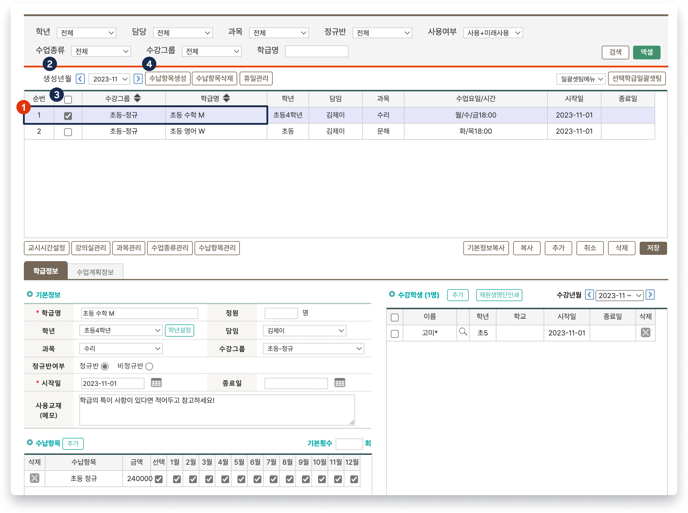
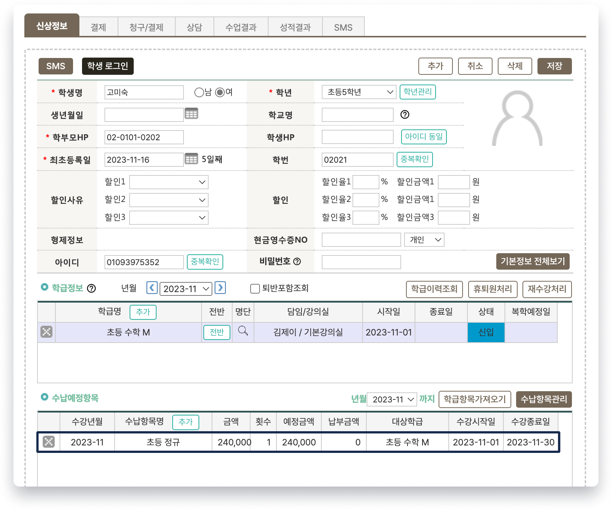

# 월 수강료 일괄 생성

## 월 수강료 일괄 <mark style="color:blue;">생성</mark>

### 생성하기

 기본메뉴 → 학급관리 → **학급관리**

**생성년월**을 선택하여 원하는 학급의 수납 항목을 일괄 생성합니다. 해당하는 년월에 학급의 수납항목이 추가 되어 있어야 합니다.

<figure><figcaption></figcaption></figure>

1. 수강료 일괄 생성을 원하는 학급을 선택합니다.
2. 수강료 생성년월을 선택
   * 년월은 드랍다운 목록을 선택하거나 년월 좌우의 `<` `>` 를 눌러 변경할 수 있습니다.
3. 체크박스를 눌러 원하는 학급을 선택
   * 순번 우측에 위치한 체크박스를 누르면 검색 된 모든 학급을 선택할 수 있습니다.
4. &#x20;을 눌러 생성을 진행합니다.

### 생성확인

 기본메뉴 → 학급관리 → **학생관리: 신상정보**

생성된 수강료는 **학생관리** 또는 **미납현황** 메뉴에서 확인할 수 있습니다.

<figure><figcaption></figcaption></figure>

## 월 수강료 일괄 <mark style="color:red;">삭제</mark>

 기본메뉴 → 학급관리 → **학급관리**

학급을 선택하여 생성된 월 수강료를 일괄 삭제할 수 있습니다. 위의 '수납항목생성'과 동일한 순서로 진행하되 마지막에 수납항목생성 대신  를 눌러 삭제를 진행합니다.


납부 완료된 수납 항목은 삭제 되지 않습니다.


