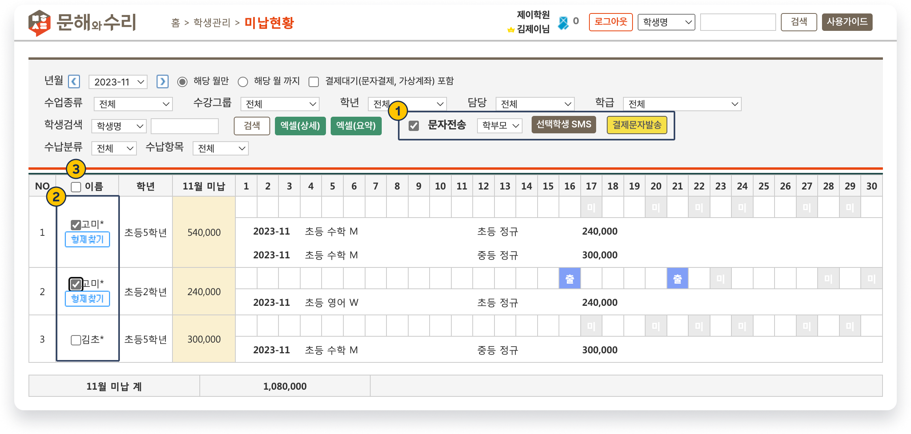
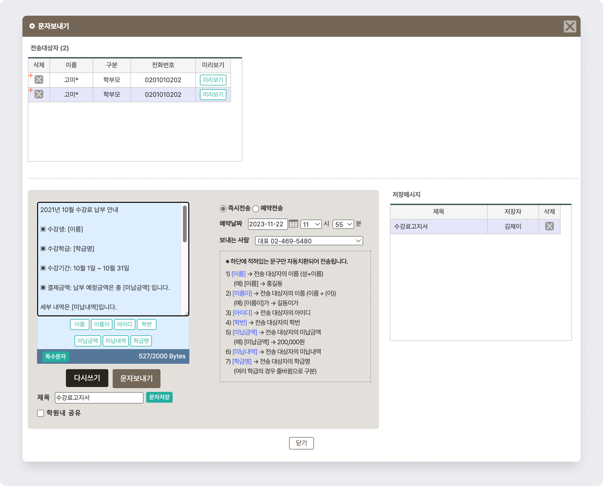
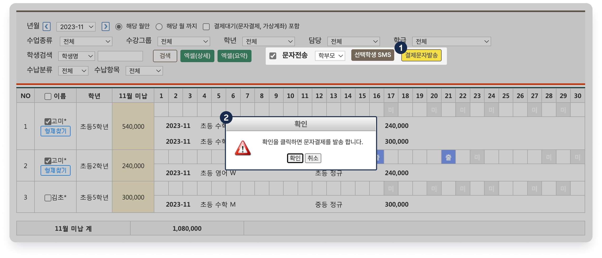

# 미납 문자 및 결제 알림톡 발송

↖ 상위항목: [수납 진행하기](../receiving/)

 기본메뉴 → 학생관리 → **미납현황**

***

## 1. 미납 문자 보내기

검색 된 학생을 대상으로 미납 안내 문자를 발송할 수 있습니다.

###  문자를 발송할 학생 선택

<figure><figcaption></figcaption></figure>

1. 미납 내역 검색 후 문자전송 왼쪽의 체크 버튼을 누르면
2. 학생의 이름 왼쪽에 ☑️ 체크 버튼이 활성화되고 개별 학생을 선택할 수 있어요.
3. 머릿글 '**이름**' 왼쪽의 ☑️ 체크 버튼을 누르면 전체 학생을 선택/해제 할 수 있습니다.

###  문자 작성과 발송

학생 선택이 완료 되면  버튼을 눌러 문자 보내기 화면을 호출합니다.

**직접 내용을 입력**하거나 **저장 메시지**를 활용하여 문자를 보낼 수 있습니다. 문자 발송에 대한 상세 설명은 [message](../../basic-feature/message/ "mention")의 내용을 참고해 주세요.

<figure><figcaption></figcaption></figure>


**미납 문자 보내기에서 사용할 수 있는 치환값**

1. **\[이름]** 전송 대상자의 이름
2. **\[아이디]** 전송 대상자의 이름 + "이"
3. **\[학번]** 전송 대상자의 학번
4. **\[미납금액]** 미납 금액의 합계
   * 조건에 따라 검색 된 미납 항목의 합계
5. **\[미납내역]** 미납 항목 별 상세 내역
   * (학급) : (수강년월) (수납항목명) (금액)&#x20;
   * 조건에 따라 검색 된 미납항목만을 포함
6. **\[학급명]** 전송 대상자의 학급명.&#x20;
   * 발송일 기준 수강중인 모든 학급이 포함


발송 전 를 이용해 보낼 문자 내용을 체크 해보는 것을 권장드립니다. **\[치환값]**&#xC744; 사용했을 때, 개별 학생이 실제 받게 될 문자의 내용을 확인할 수 있어요.

<figure><figcaption></figcaption></figure>

## 2. 문자 결제 알림톡 보내기


결제 문자 발송을 하려면 **결제선생** 서비스에 가입이 되어 있어야 합니다.

* 결제 선생 가입 및 사용에 대한 내용은 [문자결제(결제선생) 사용하기↗](broken-reference) 를 참고하세요


미납 내역을 검색하고 학생이 선택된 상태에서  를 누르면 결제 선생 알림톡을 전송할 수 있습니다.

<figure><figcaption></figcaption></figure>
