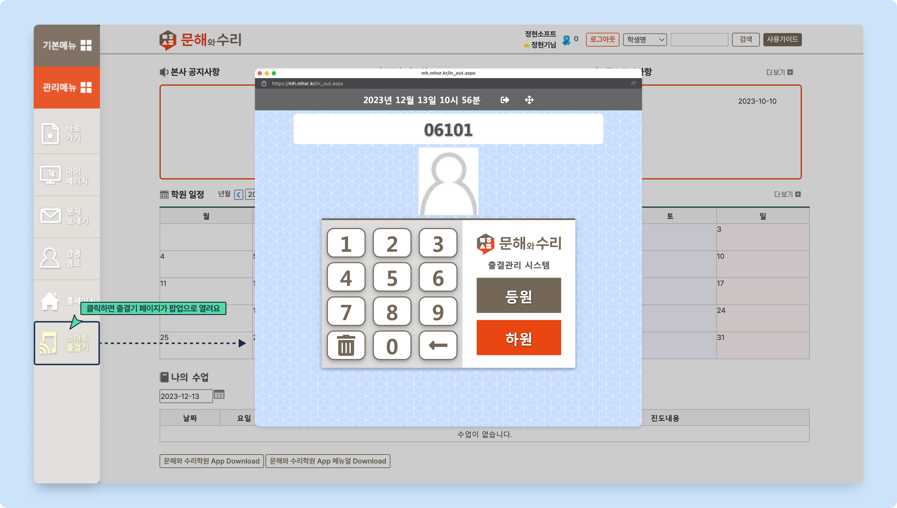
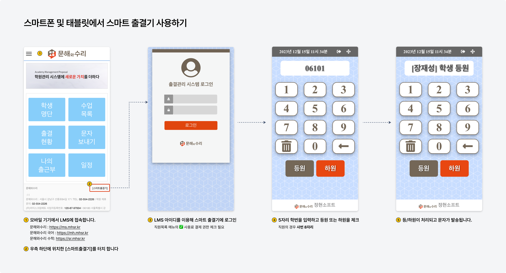
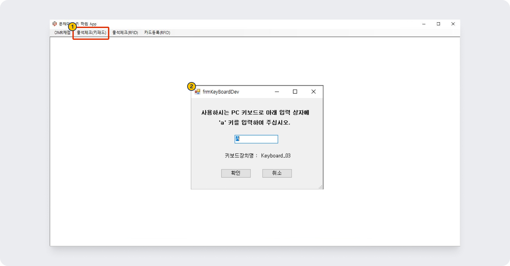
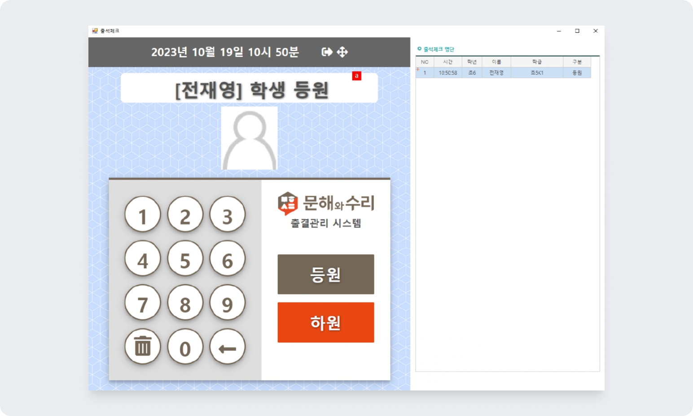

# 등하원 체크와 문자 발송

## 등하원 자동 문자 설정


 관리메뉴 → 학원정보 → **학원정보관리**


스마트 출결기를 이용한 등하원 체크 시 발송되는 문자의 내용과 발송 여부를 설정할 수 있어요.

등하원 체크 시점에서 문자 포인트가 없으면 자동 문자는 발송 되지 않습니다.

<figure><figcaption></figcaption></figure>

1. **SMS 발송용 전화번호**: 등하원 문자 발송 시 보내는 번호를 확인할 수 있어요. 대표 발송 번호의 변경은 본사로 문의주셔야 합니다.
2. **등원문자**: 스마트 출결기에서 을 체크했을 때 발송되는 문자의 내용을 변경할 수 있습니다.
   * 입력 된 내용을 모두 지우고 저장하면 등원 체크 시 등원 문자를 발송하지 않습니다.
3. **하원문자**: 스마트 출결기에서 을 체크했을 때 발송되는 문자의 내용을 변경할 수 있습니다.
   * 입력 된 내용을 모두 지우고 저장하면 **하원 체크** 시 **하원 문자**를 발송하지 않습니다.
4. **치환값**: 학생에 따라 자동으로 변경되는 \[치환값]을 활용할 수 있어요. 사용할 수 있는 치환값 목록은 이미지를 참고해주세요.

## 스마트 출결기 사용

다양한 기기에서 스마트 출결기를 사용할 수 있습니다.


&#x20;✅ **사용료 결제 권한**이 부여된 직원만 스마트출결기에 로그인 할 수 있어요.

[사용료 결제 권한 부여 방법 →](../../basic-feature/staff/add.md#3-b)


### 데스크탑

왼쪽 사이드 메뉴의 스마트출결기를 클릭하면 출결기 페이지가 팝업으로 열려요. 로그인 하지 않은 상태에서 클릭 시 로그인을 진행해주셔야 합니다.

<figure><figcaption></figcaption></figure>

### 스마트폰 및 태블릿

<figure><figcaption></figcaption></figure>

1. 모바일 기기의 웹브라우저에서 LMS 페이지로 이동
   * 문해와수리 브랜드 : https://ms.mhsr.kr
   * 문해와수리 국어 브랜드 : https://mh.mhsr.kr
   * 문해와수리 수학 브랜드 : https://sr.mhsr.kr
   *  각 브랜드 주소의 뒤에 /in\_out.aspx 를 붙이면 스마트 출결기 페이지로 바로 이동 가능
2. 우측 하단의 \[스마트 출결기] 눌러주세요.
3. LMS 아이디를 이용해 스마트 출결기에 로그인합니다.
4. 5자리 학번을 입력하고 등원 또는 하원을 체크
   * 직원의 출퇴근 체크는 8자리 사번을 이용
5. 등하원이 시스템에 기록되고 처리되고 문자가 발송됩니다.

### 숫자 키패드

[숫자 키패드](https://www.google.com/search?q=%EC%88%AB%EC%9E%90+%ED%82%A4%ED%8C%A8%EB%93%9C\&newwindow=1\&sca_esv=591053097\&gbv=2\&sei=KcZ7ZZ3GFtSG-Qb--4gI)를 데스크탑 PC에 연결해 등하원 체크에 사용할 수 있어요.

1. 숫자 키패드를 PC에 연결하고 **문해와 수리 앱** 실행 후 **출석체크(키패드)** 메뉴를 클릭합니다.&#x20;
2. 키보드 확인을 위해 a키 입력 후 확인을 눌러주세요.

<figure><figcaption></figcaption></figure>

연결된 숫자 키패드를 이용해 등하원을 체크할 수 있어요. 출결기 화면 오른쪽에는 체크 명단이 표시됩니다.

* : 학번 입력 후 `Enter` 또는 **`+`** 입력
* : 학번 입력 후 **`-`** 키 입력&#x20;

<figure><figcaption></figcaption></figure>
