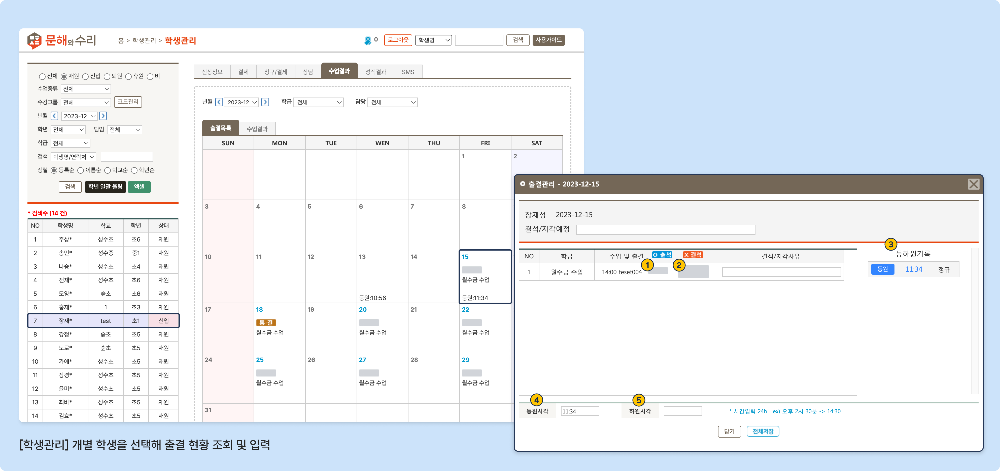
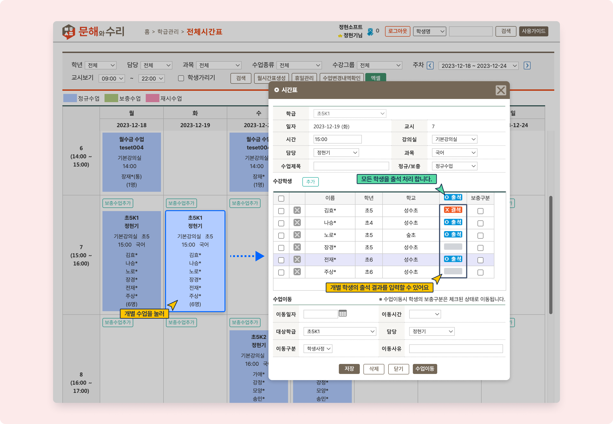
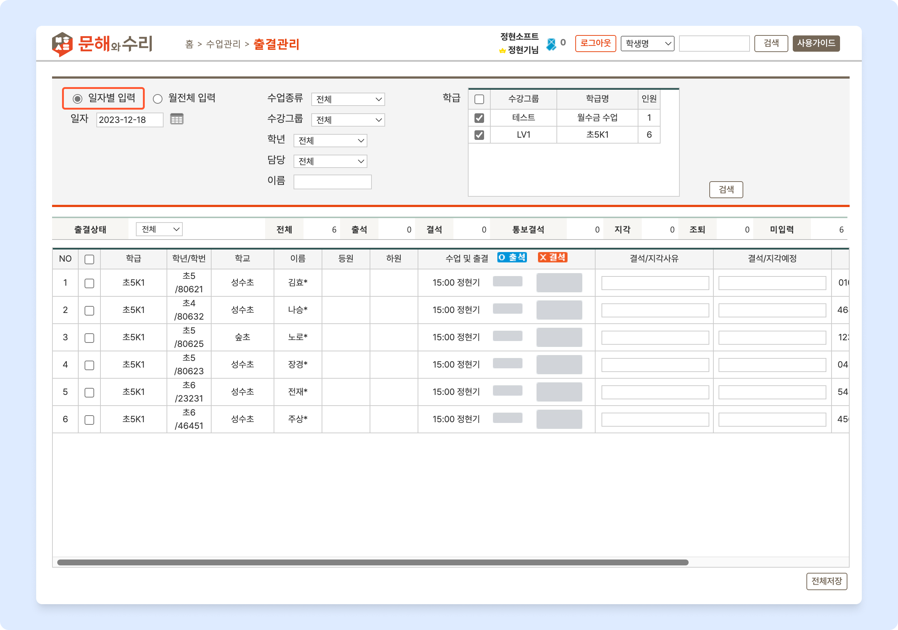
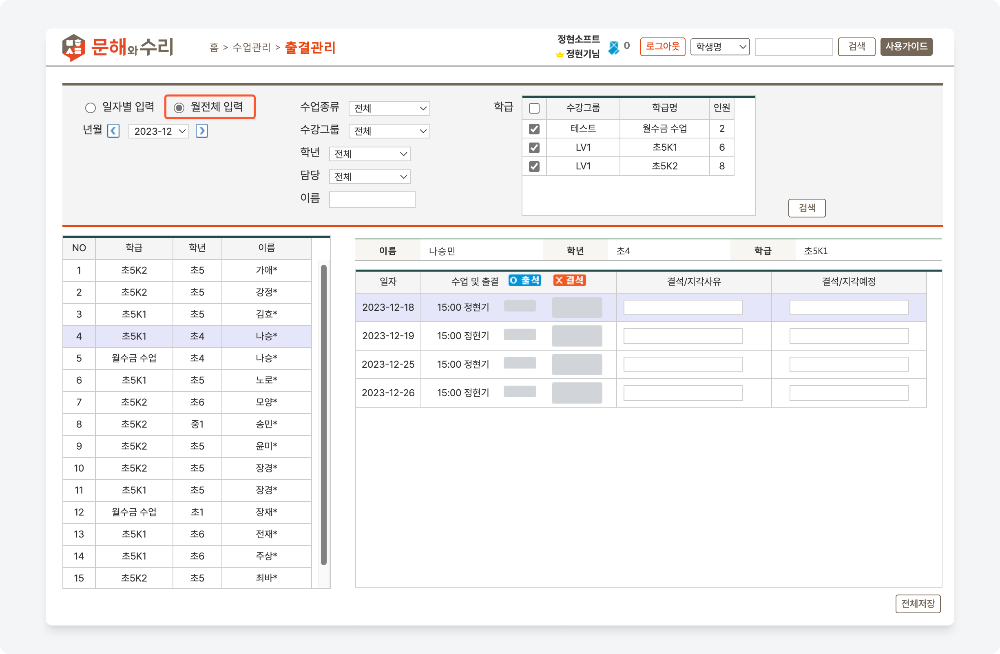

# 출석 결과 기록하기


수동으로 출석 결과 저장 시 등하원 안내 문자는 발송되지 않습니다.



#### 선택 가능한 출석 결과 입력 값

 수업에 출석함

 수업에 결석함

 통보 후 예정된 결석

 수업 시작 시간 보다 늦게 출석

 수업 종료 전 귀가 한 경우


## 개별 학생을 선택해 기록


 기본메뉴 → 학생관리 → **학생관리**


학생을 선택하고  →  탭으로 이동 후 날짜를 선택하면 해당 날짜의 출결을 관리할 수 있어요.

<figure><figcaption>
개별 학생을 선택해 출석 결과 입력
</figcaption></figure>

1. **개별 수업**의 출결을 입력합니다. 버튼을 누를 때마다 값이 변경됩니다.
2. 해당 날짜에 여러 수업이 있는 경우 한 번에 출결 기록을 입력할 수 있어요.
3. 해당 날짜의 등하원 체크 기록을 모두 볼 수 있습니다.
4. 등원시각: 해당 일의 **최초 등원** 체크 시간
5. 하원시각: 해당 일의 **최종 하원** 체크 시간

## 수업을 선택해 기록


 기본메뉴 → 학급관리 → **전체시간표**


전체 시간표 메뉴에서 개별 수업을 눌러 학생의 출석결과를 기록할 수 있어요. 입력 방식은 개별 학생을 선택하여 입력하는 방식과 동일합니다. \
머리글 행의  을 누르면 결과가 입력되지 않은 학생의 출결 기록을 출석으로 채웁니다.

<figure><figcaption>
전체 시간표에서 출석 결과 입력
</figcaption></figure>

수업 목록 메뉴에서 출석 결과를 기록하는 방법은 [수업 결과 기록](../results/input.md#undefined-2) 페이지를 참고해주세요.

## 일 또는 월 단위로 입력


 기본메뉴 → 수업관리 → **출결관리**


일 단위로 학생을 검색해 입력하거나 월단위로 특정 학생을 선택해 출결을 한 번에 기록할 수 있어요.

보기 유형( :radio\_button:일자별 입력 /:radio\_button:월전체입력)을 선택하고 조건에 따라 검색 후 출결을 기록 후 저장합니다.



<figure><figcaption></figcaption></figure>



<figure><figcaption></figcaption></figure>


