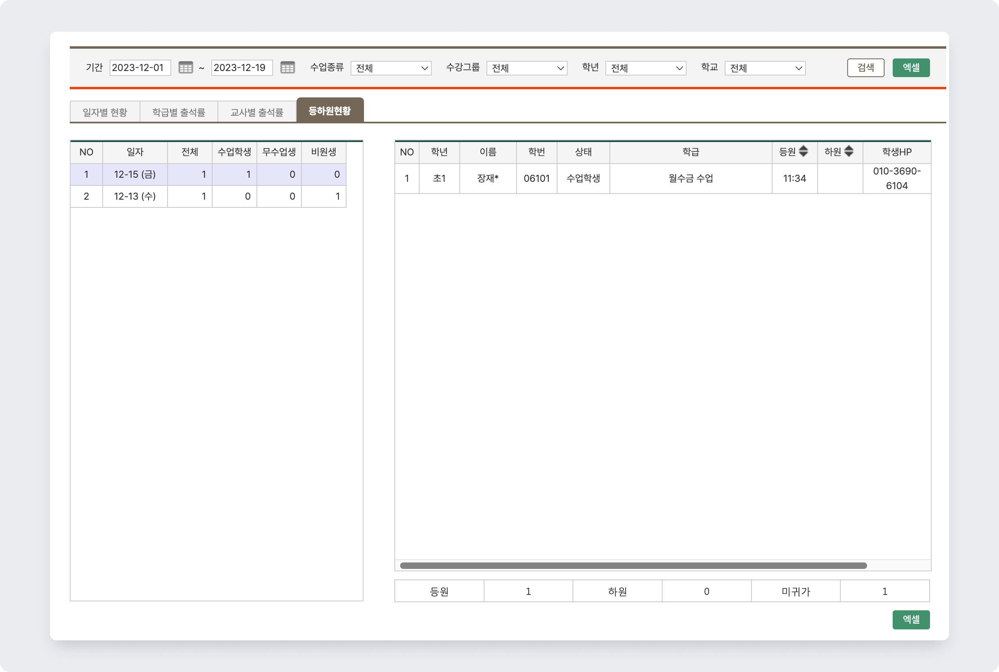

# 출결 통계 조회


 기본메뉴 → 수업관리 → **출결현황**


## 일자별 현황

선택한 기간 내 일자를 기준으로 출결 현황을 확인할 수 있어요.&#x20;

날짜의 인원 수(총수업 수강생, 수업 인원)를 누르면 조건에 맞는 학생들만 모아서 볼 수 있어요. 출결 사항을 입력하거나 수정하는 것도 가능합니다.

<figure><figcaption></figcaption></figure>

1. 열의 조건에 맞는 학생들만 모아볼 수 있습니다.
2. 출결 현황과 사유를 입력할 수 있어요.
3. 출결 현황이 비어있는 학생을 모두 출석 처리합니다.
4. 변경사항을 저장합니다.

## 학급별 출석률

학급을 기준으로 학생의 출석 현황과 통계를 확인할 수 있어요.

<figure><figcaption></figcaption></figure>

## 교사별 출석률

담당 교사를 기준으로 학생의 출석 통계를 조회합니다.

<figure><figcaption></figcaption></figure>

## 등하원 현황

수업 일자를 기준으로 학생의 등하원 시간을 확인할 수 있어요.

<figure><figcaption></figcaption></figure>
