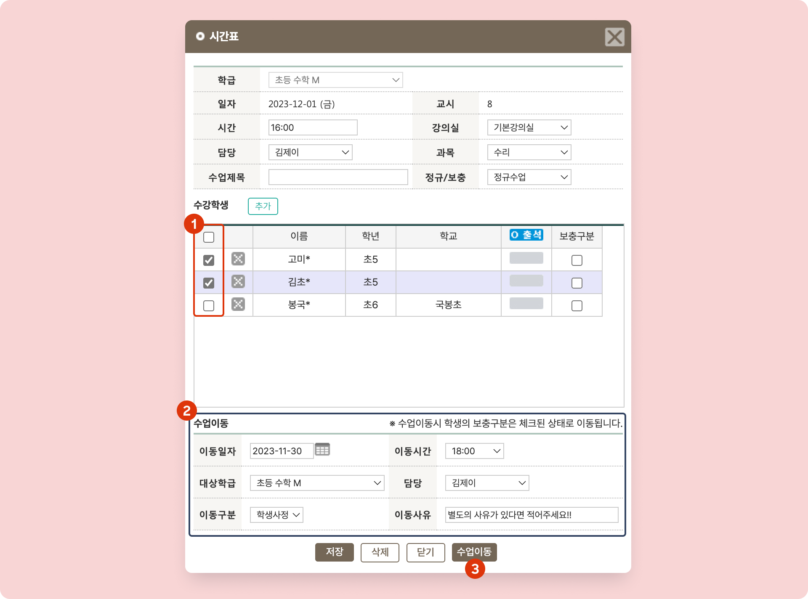

# 수업 정보 수정


 기본메뉴 → 학급관리 → **전체시간표**

→ 선행 기능: [new-schedule.md](../../basic-feature/class-schedule/new-schedule.md "mention")


***

만들어진 수업의 정보를 수정할 수 있습니다. 학생을 다른 수업으로 옮기거나 제외하는 것도 가능해요.&#x20;

수업을 클릭하면 수업 수정 팝업이 나타나고 정보를 수정할 수 있어요.

<figure><figcaption>
수업 정보 클릭 시
</figcaption></figure>

## 1. 수업 정보 변경

학급을 제외한 나머지 정보를 수정할 수 있어요. 변경 사항은 해당 수업에만 적용됩니다.


 \
**수업 제목**을 이용하면 해당 수업에서 체크할 내용을 기록하고 빠르게 탐색할 수 있어요.


<figure><figcaption></figcaption></figure>

## 2. 수강 학생 추가 및 제외

<figure><figcaption></figcaption></figure>

### 1) 수업에서 학생 제외하기

학생명 왼쪽의 ❎ 눌러 개별 학생을 수업에서 제외할 수 있어요. 수업 제외는 선택한 수업에 한정됩니다.

제외한 학생을 다시 수업에 복귀 시키기는 방법은 [수업 변경 사항 취소](timetable.md#undefined-1)를 참고해주세요.

### 2) 수강학생 추가하기

수강학생 우측의 버튼을 누르면 학생 추가를 위한 검색 창이 확장되고 원하는 학생을 해당 수업에 추가할 수 있어요.

선택한 수업에만 학생이 추가 됩니다.

<figure><figcaption>
수업에 수강 학생 추가
</figcaption></figure>

1. 검색 조건을 이용해 학생을 검색하세요.
2. 추가를 원하는 학생을 검색하고 선택합니다.
3. 팝업 가운데 위치한 ⬅️ 를 누르면 체크 학생이 수강학생 목록에 추가됩니다.
4. 팝업 창 최하단의 을 누르면 수강 학생 추가 과정이 완료됩니다.

## 3. 수업 이동 기능

일회성으로 1명 이상의 다른 학급의 수업에 참여하거나 수업 시간이 변경되는 경우 **수업 이동** 기능을 활용할 수 있어요.

<figure><figcaption>
수업 이동
</figcaption></figure>

1. 수업 이동을 하려는 **1명 이상의 학생을** 체크하여 선택
2. **이동 정보**를 입력/선택 합니다.
   * **이동 일자**: 이동 일자를 선택합니다.
   * **이동 시간**: 이동 시간을 선택. [교시 시간 설정](../../basic-feature/class-setting/time.md)에 존재하는 시작 시간만 선택할 수 있어요.
   * **대상 학급**:  수업의 대상 학급이 변경 되는 경우
   * **담당**: 수업 담당이 변경 되는 경우
   * **이동 구분**: 학생, 강사 중 누구의 사정으로 이동되었는지 구분하기 위한 값입니다. [수업 변경 내역 조회](timetable.md#5.)의 검색 값으로 사용됩니다.
   * **이동 사유**: 이동 사유를 남길 수 있어요.
3.  버튼을 누르면 이동 처리가 완료됩니다. 이동 된 학생은 수업에 보이지 않습니다.
   *  \
     **모든 학생**이 수업 이동 처리되면 (수업에 남은 학생이 없으면) 해당 수업은 전체 시간표에서 보이지 않아요.
