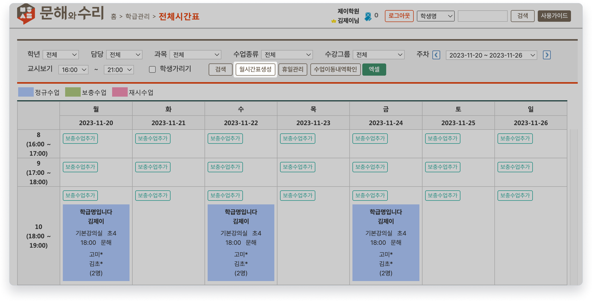

# 수업 수동 생성

↖ 상위항목: [학급과 수업 만들기](../../basic-feature/class-schedule/)

→ 선행기능: [수업 일정 만들기](../../basic-feature/class-schedule/new-schedule.md)

## 월시간표 생성

 기본메뉴 → 학급관리 → **전체시간표**

수업 계획 정보를 기반으로 날짜를 지정해 수업을 추가할 수 있어요. 수업이 생성이 되지 않았거나 삭제되었을 때 사용합니다.

<figure><figcaption>
월 시간표 생성 버튼
</figcaption></figure>

### 수업 생성하기

 버튼을 눌러 팝업창을 열고 아래의 과정을 진행합니다.

<figure><figcaption>
월 시간표 생성 과정
</figcaption></figure>

1. 스케줄이 생성될 일자 범위를 지정합니다. (미래의 날짜는 지정할 수 없습니다.)
2.  를 눌러 스케줄 생성을 진행합니다.
3. 확인을 누르면 학급의 수업계획정보를 기준으로 지정 된 날짜의 수업이 만들어집니다.

