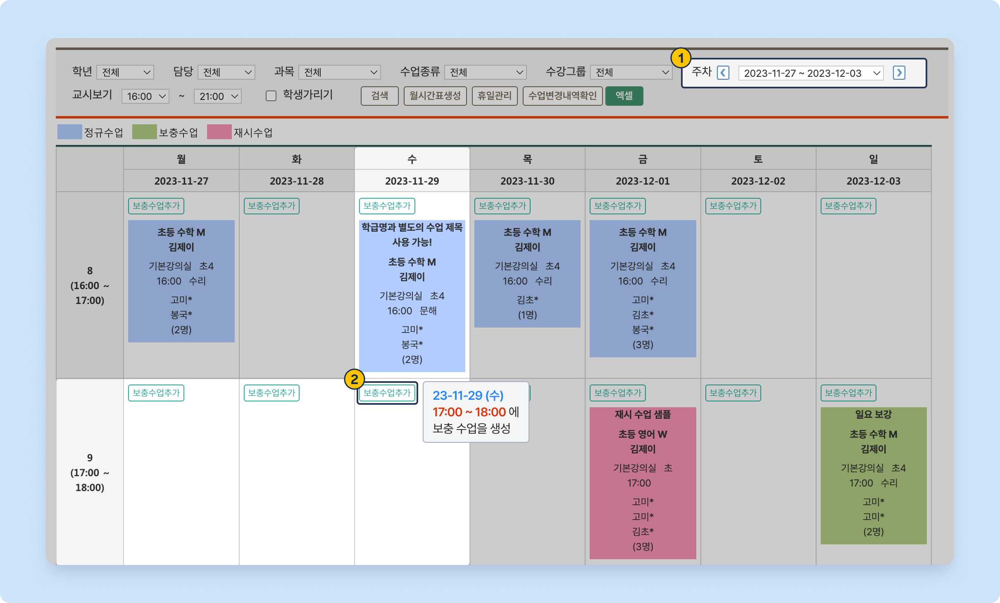
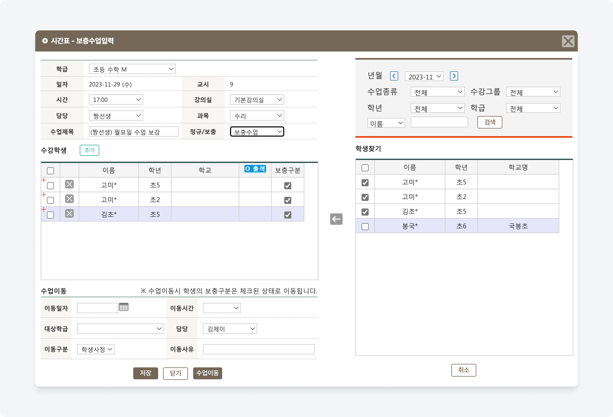
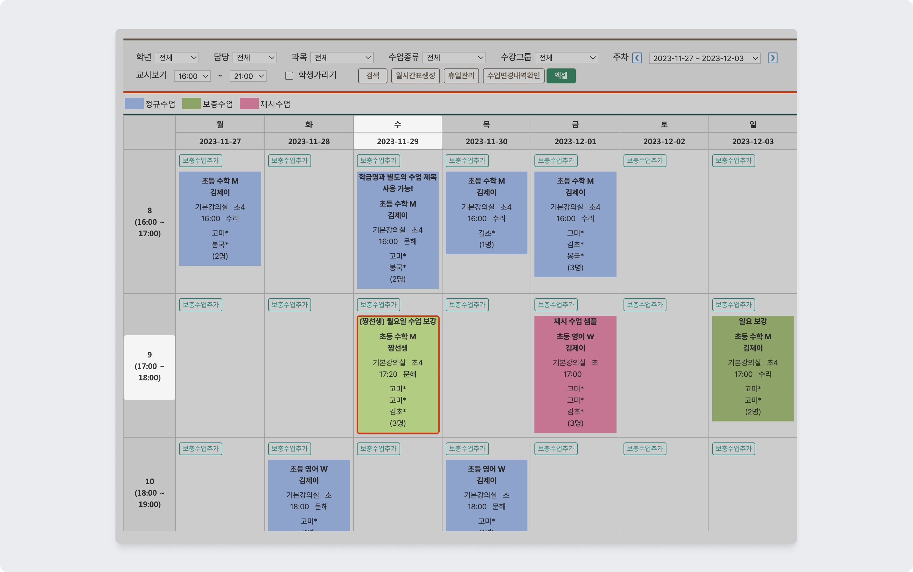
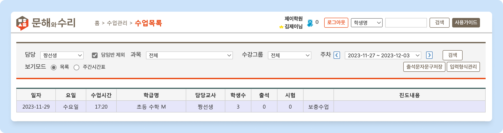

# 보충 수업 만들기

 기본메뉴 → 학급관리 → **전체시간표**

## 1. 날짜 및 시간 선택

<figure><figcaption>
보충 수업 날짜와 시간 찾기
</figcaption></figure>

1. 보충 수업을 추가할 **주간** (Week)으로 이동합니다.
   * 주차 목록에 있는 를 눌러 주간 단위로 이동할 수 있어요.&#x20;
2. 보충 수업이 진행되는 **날짜와 시간대가 교차**하는 블럭의 상단에 위치한 를 누르면 보충 수업의 생성 정보를 입력할 수 있어요.

## 2. 학생 추가 및 수업 정보 입력


**재원생**만 보충 수업에 추가할 수 있어요.


보충 수업 정보를 입력하고 수강 학생을 추가 후 버튼을 누르면 보충 수업이 생성됩니다.  생성 된 보충 수업은 [**전체시간표**](timetable.md) 및 **수업 목록**에서 확인할 수 있어요.

<figure><figcaption>
보충 수업 입력 팝업
</figcaption></figure>

### 입력 항목  상세

<table data-full-width="false"><thead><tr><th width="76" align="center">NO</th><th width="135">항목명</th><th width="72" align="center">필수</th><th>내용</th></tr></thead><tbody><tr><td align="center">1</td><td>학급</td><td align="center">✅</td><td>보충 수업의 기준이 되는 학급을 선택합니다.</td></tr><tr><td align="center">2</td><td>일자</td><td align="center">✅</td><td>선택한 날짜가 표시 됩니다.</td></tr><tr><td align="center">3</td><td>시간</td><td align="center">✅</td><td>수업 시작 시간을 선택합니다. 10분 단위로 선택할 수 있어요.</td></tr><tr><td align="center">4</td><td>강의실</td><td align="center"></td><td>보충 수업이 진행되는 강의실 정보</td></tr><tr><td align="center">5</td><td>담당</td><td align="center">✅</td><td>수업을 진행하는 강사를 지정합니다. - 담당으로 지정되면 해당 강사의 수업 목록에서 보충 수업을 확인하고 결과를 기록할 수 있어요.</td></tr><tr><td align="center">6</td><td>과목</td><td align="center"></td><td>과목을 선택합니다.</td></tr><tr><td align="center">7</td><td>수업제목</td><td align="center"></td><td>수업을 식별할 수 있는 제목을 입력. 수업의 목적을 적어주면 좋아요.</td></tr><tr><td align="center">8</td><td>정규/보충</td><td align="center">✅</td><td>수업의 유형 선택. </td></tr><tr><td align="center">9</td><td>수강학생</td><td align="center">✅</td><td>보충 수업을 수강할 학생을 추가 합니다. - 수강학생 우측의  버튼을 눌러 학생을 선택할 수 있어요. - 보충 수업의 생성을 위해서는 1명 이상의 학생이 추가되어야 합니다.</td></tr></tbody></table>

### 생성된 보충 수업 보기

####  전체 시간표 보기

<figure><figcaption>
전체시간표: 보충 수업 보기
</figcaption></figure>

####  수업 목록에서 보기

<figure><figcaption>
수업목록: 보충 수업 보기
</figcaption></figure>

## 3. 출결 및 수업 결과 기록

보충 수업 입력이 완료되면 정규 수업과 동일하게 출결 및 수업 결과를 기록할 수 있어요.

수업 결과를 기록하는 방법은 [수업 결과 기록](../results/input.md)을 참고해주세요!
