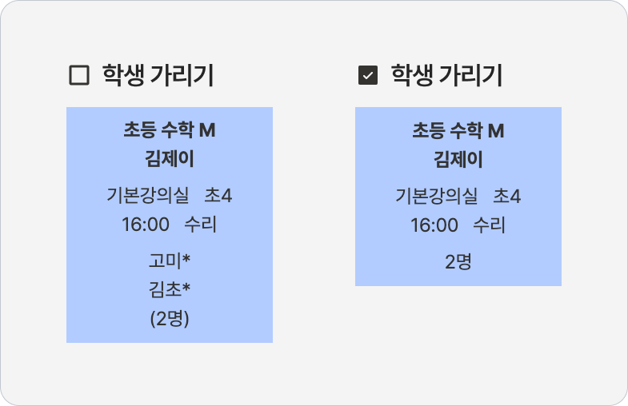
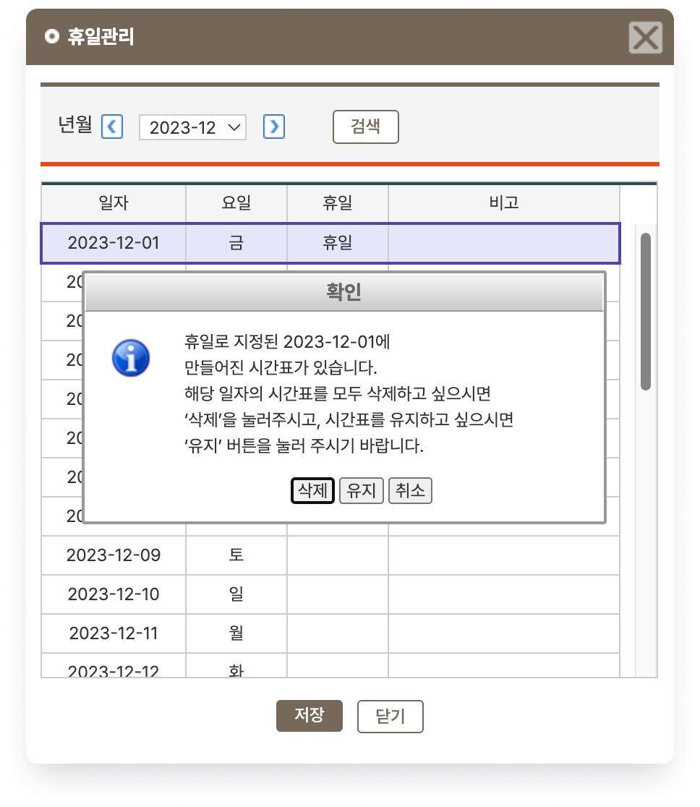

# 전체 시간표

 [수업 계획 관리](./)\
 [수업 계획 만들기](../../basic-feature/class-schedule/new-schedule.md)\
 기본메뉴 → 학급관리 → **전체시간표**

저장된 수업 계획 정보를 이용해 시간표가 생성되면 학원 전체의 수업 스케줄을 관리할 수 있어요. 수업 스케줄은 주간 단위로 관리할 수 있습니다.


**수업 자동 생성**

학급 정보에 지정되어 있는 수업 계획 정보를 이용해 매일 새벽에 수업을 자동으로 생성하며 사용일 기준 30일 이후 까지의 수업 시간표가 미리 만들어집니다.

**30일 이후** 날짜의 수업을 생성하려면 [수업 수동 생성 ↗](manu.md) 기능을 이용해 주셔야 합니다.


<figure><figcaption></figcaption></figure>

## 상단 검색 영역

<figure><figcaption></figcaption></figure>

### 1. 검색 필터

검색 조건을 지정하여 보이는 시간표를 필터링 할 수 있어요. 조건 선택 후 을 눌러 확인할 수 있습니다.

### 2. 학생 가리기

&#x20;수업에 포함된 학생의 이름 대신 인원 수만 보여줍니다. 최종 선택 값은 브라우저에 저장됩니다.

<figure><figcaption></figcaption></figure>

### 3. 월시간표 생성

수업 계획 정보를 이용해 특정일의 수업을 수동으로 생성합니다.  상세한 내용은 [manu.md](manu.md "mention") 문서를 확인해주세요.

### 4. 휴일 관리

학원의 휴일을 지정할 수 있어요. 휴일로 지정된 날짜는 수업이 만들어지지 않습니다.&#x20;

미리 수업이 만들어진 날짜를 휴일로 지정하고  시, 수업 유지 및 삭제 여부를 물어보는 확인 창이 출력됩니다.

<figure><figcaption>
수업이 생성 된 일자의 휴일 지정
</figcaption></figure>

### 5. 수업 변경 내역 확인

수업 이동, 학생 삭제 (수업에서 학생이 삭제 된 경우) 내역을 확인할 수 있어요. 조건을 지정해 검색하거나 목록을 엑셀 파일로 내려받을 수 있습니다.

수업에 포함된 학생을 다른 시간으로 이동하거나 삭제하는 방법은 [수업 계획 수정하기](correction.md)에서 자세히 설명합니다.

<figure><figcaption></figcaption></figure>

#### 수업 변경 취소하기

각 변경 건 왼쪽의 ❎ 를 눌러 변경 사항을 취소할 수 있어요. 취소가 완료 되면 이동 및 삭제 전 수업으로 복귀합니다.
