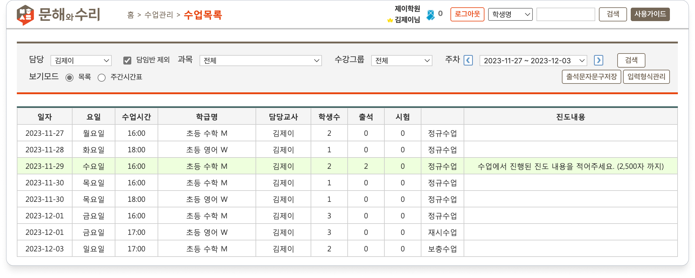
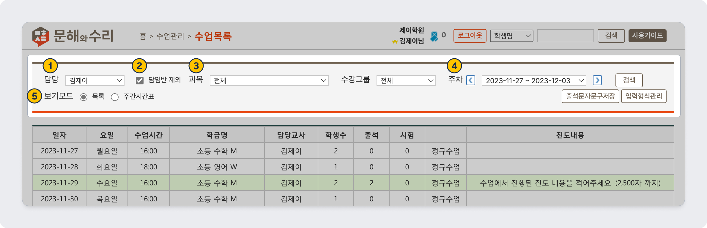
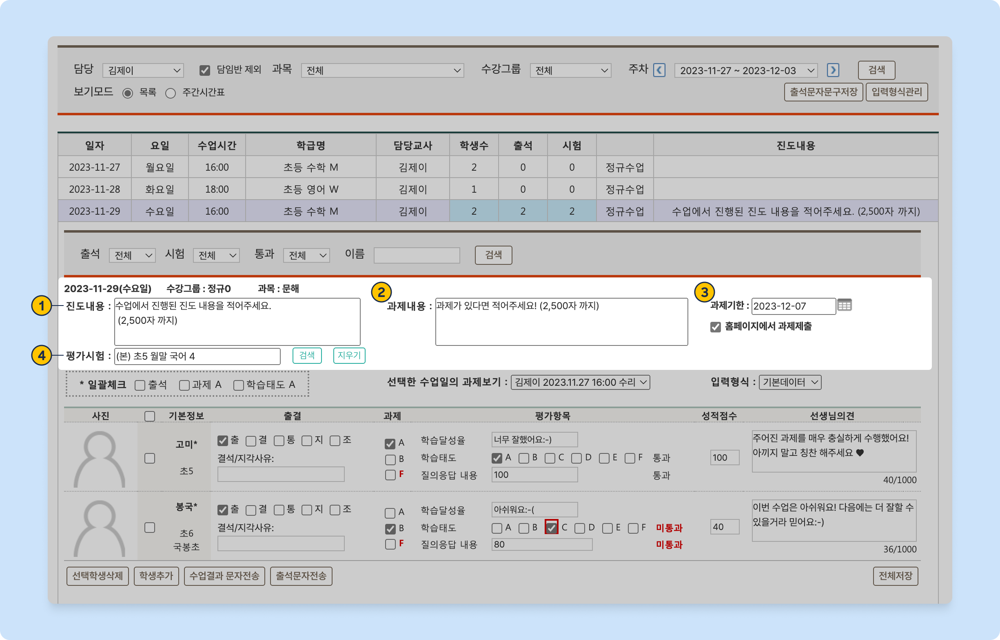
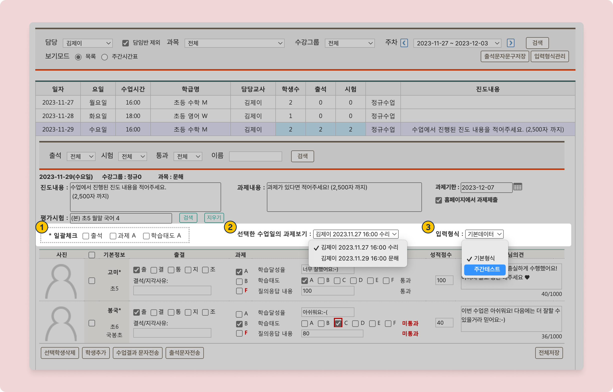
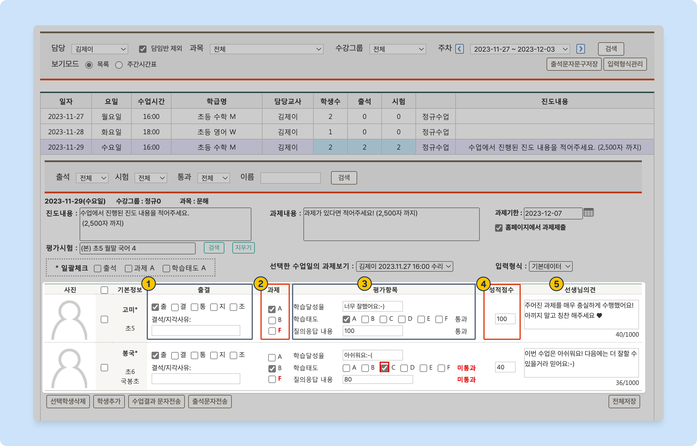
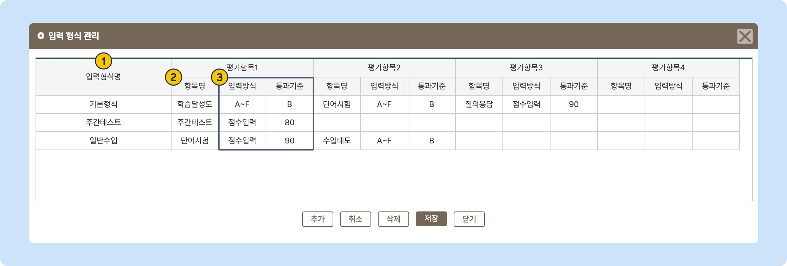

# 수업 결과 기록

 기본메뉴 → 학급관리 → **수업목록**

## 수업 목록

LMS 시스템에 수업의 결과를 입력할 수 있어요.  기록된 수업 결과는 문자로 발송하거나 연동 홈페이지에서 학생의 아이디로 로그인하여 조회할 수 있습니다

메뉴 진입 시 로그인한 직원이 담임/담당으로 지정된 수업의 목록을 볼 수 있어요.&#x20;

각 수업을 클릭하면 결과를 입력할 수 있습니다.  아래의 안내를 따라 수업 결과를 입력 후 을 눌러주시면 수업 결과 저장이 완료 됩니다.

<figure><figcaption></figcaption></figure>


&#x20;

* 수업의 날짜가 **오늘**이고 **내 담당 수업**이라면 녹색 음영으로 표시됩니다.
* **조회용 관리자** 권한이 부여되어 있는 직원은 담당/담임 여부와 관계 없이 **모든 수업**을 볼 수 있어요.


## 상단 검색 영역 항목

<figure><figcaption></figcaption></figure>

1. **담당**: 수업의 담당을 기준으로 목록을 필터링합니다. 조회용 관리자가 아닌 경우 다른 직원을 선택할 수 없어요.
2. **담임반 제외**: 담당으로 지정된 수업만 조회합니다.
3. **과목, 수강그룹**: 해당 항목을 선택하여 필터링 합니다.
4. **주차**: 주차 별 수업 목록을 볼 수 있어요.
5. &#x20;**보기모드**: 수업 목록을 보는 방식을 변경합니다. 선택 값은 브라우저에 쿠키로 저장됩니다.
   * **주간 시간표:** 전체 시간표와 동일한 형태로 수업을 볼 수 있으며, 각 수업 클릭 시 수업 결과를 입력할 수 있는 팝업이 오픈됩니다.

## 수업 결과 입력하기

### 1. 공통 항목 입력

수업을 진행한 모든 학생에게 공통으로 적용되는 입력 요소들입니다.

치환값에 대한 내용은 [문자 발송 치환값](undefined.md#undefined-1)의 내용을 참고해주세요.

<figure><figcaption></figcaption></figure>

<table><thead><tr><th width="154">항목명</th><th width="443">입력내용</th><th>문자발송 치환값</th></tr></thead><tbody><tr><td><ol><li>진도내용</li></ol></td><td>수업에서 진행된 진도 내용을 기록힙니다 (2,500자 까지 입력 가능)</td><td><strong>[진도내용]</strong></td></tr><tr><td><ol start="2"><li>과제내용</li></ol></td><td>수업에서 부여된 과제의 내용을 기록  (2,500자 까지 입력 가능)</td><td><strong>[과제내용]</strong></td></tr><tr><td><ol start="3"><li>과제기한</li></ol></td><td>과제의 제출 기한을 입력합니다. ✅ <strong>홈페이지에서 과제 제출</strong> 체크 시 학생이 홈페이지 로그인하여 과제 이미지를 올릴 수 있어요.</td><td><strong>[</strong><a data-footnote-ref href="#user-content-fn-1"><strong>과제내용</strong></a><strong>]</strong></td></tr><tr><td><ol start="4"><li>평가시험</li></ol></td><td>수업 중에 시험이 진행되었다면 수업 결과에 추가할 수 있어요. - 학생 별 시험 점수는 (채점이 되어 있다면) 선택한 시험에 맞게 자동으로 '<strong>성적점수</strong>'란에 입력됩니다.</td><td><strong>[모의고사결과]</strong></td></tr></tbody></table>

### 2. 수업 결과 입력 부가 옵션

<figure><figcaption></figcaption></figure>

1. **일괄체크:** 출석, 과제 및 평가항목을 일괄 입력 할 수 있습니다. 평가항목은 알파벳 입력 방식일 경우에만 일괄체크가 가능해요.
2. **선택한 수업일의 과제 보기:** 학생이 홈페이지를 통해 제출한 과제를 확인할 수 있어요. 직전 수업과 현재의 수업을 각각 선택해서 볼 수 있어요.
3. **입력형식:** 평가항목 형식을 선택해 수업 결과를 입력할 수 있습니다.&#x20;
   * 더보기: [평가항목 템플릿 설정 방법](input.md#4.)

### 3. 개별 항목 입력

개별 학생의 수업 결과 내용을 기록할 수 있어요.

<figure><figcaption></figcaption></figure>

<table><thead><tr><th width="159.33333333333331">항목명</th><th width="391">입력내용</th><th>문자발송 치환값</th></tr></thead><tbody><tr><td><ol><li>출결</li></ol></td><td>출결 현황과 결석/지각 사유를 기록합니다.</td><td>[<a data-footnote-ref href="#user-content-fn-2">출석</a>]</td></tr><tr><td><ol start="2"><li>과제</li></ol></td><td>A/B/F 중 하나를 선택하여 수업의 과제를 평가합니다.</td><td>[금일통과여부] [금일학습결과]</td></tr><tr><td><ol start="3"><li>평가항목</li></ol></td><td>평가항목을 입력합니다. 매 수업마다 다른 입력형식을 사용하여 결과를 기록하는 것이 가능해요.</td><td>[<a data-footnote-ref href="#user-content-fn-3">금일통과여부</a>] [금일학습결과] [평가항목결과]</td></tr><tr><td><ol start="4"><li>성적점수</li></ol></td><td>평가시험 입력에서 선택 된 시험에서 학생이 획득한 점수가 자동 기입됩니다.</td><td>[<a data-footnote-ref href="#user-content-fn-4">모의고사결과</a>] </td></tr><tr><td><ol start="5"><li>선생님의견</li></ol></td><td>학생별 코멘트를 입력합니다. (최대 1,000자 까지)</td><td>[선생님의견]</td></tr></tbody></table>

### 4. 입력형식관리

메뉴 우측 상단의 를 눌러 평가항목 템플릿을 관리할 수 있습니다. 입력 형식 당 최대 4개 까지 평가 항목을 설정할 수 있어요.


 **입력 형식 응용하기**\
과목이나 학년로 평가 항목을 다르게 사용하거나, 주간테스트가 진행되는 수업에 별도의 항목을 사용하는 방식 등으로 응용할 수 있어요.


<figure><figcaption>
입력 형식 관리
</figcaption></figure>

1. **입력 형식명**:  입력 형식의 이름
2. **항목명**: 개별 평가 항목의 이름
3. **입력방식/통과기준**: 개별 평가 항목의 입력 방식과 통과 기준을 설정합니다.

<table><thead><tr><th width="138">입력방식</th><th width="212">선택(입력) 가능한 항목</th><th>통과기준</th></tr></thead><tbody><tr><td>A~F</td><td>A/B/C/E/F 중 택 1</td><td>선택한 문자를 포함하여 순서가 빠른 문자가 입력 되면 통과 처리  (예) C 선택시: A, B, C -> 통과 / D, F -> 미통과</td></tr><tr><td>ABF</td><td>A/B/F 중 택 1</td><td>위와 동일</td></tr><tr><td>OX</td><td>O/X 택 1</td><td>선택한 값만 통과</td></tr><tr><td>점수입력</td><td>숫자를 입력</td><td>'통과기준' 이상의 값이 입력되면 통과 처리</td></tr><tr><td>직접입력</td><td>텍스트로 평가 내용을 입력</td><td>통과 기준 사용 불가</td></tr></tbody></table>

[^1]: 과제 내용이 비어있으면 과제 기한을 입력해도 \[과제내용] 치환값에 포함되지 않아요.

[^2]: 결석/지각 사유는 포함되지 않아요.

[^3]: 통과 여부를 표시하는 항목만 포함됨

[^4]: \* 성적결과를 포함하기 위해서는 성적분석 메뉴에서 평균산출이 선행되어야 합니다.
