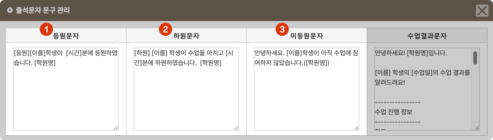
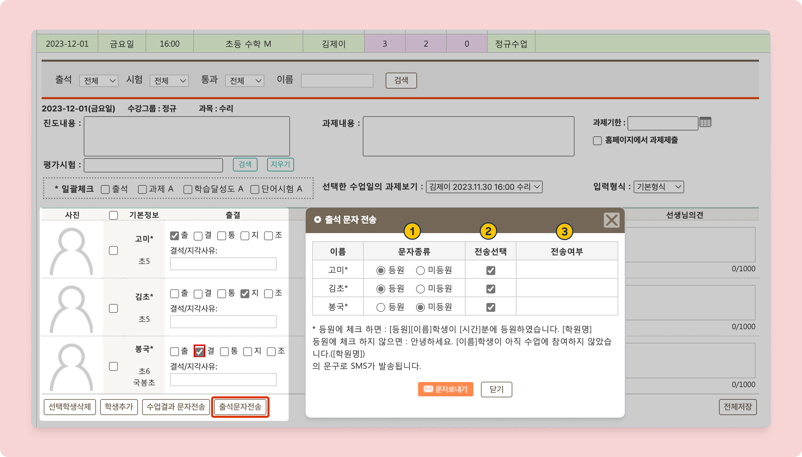

# 출결 현황 문자 발송

 기본메뉴 → 학급관리 → **수업목록**

## 출석문자 양식 관리

등원문자, 하원문자, 미등원문자, 수업결과문자의 전송 양식을 수정할 수 있어요. 메뉴 우측 상단의 을 눌러 설정합니다.


**관리메뉴 → 학원정보 → 학원정보관리**에서도 양식을 수정할 수 있어요. 변경 사항은 서로 연동됩니다.


<figure><figcaption></figcaption></figure>

1. **등원문자**
   * **스마트 출결기**를 이용한 등원 체크 시 자동 발송
   * [출석 문자 전송](undefined.md#undefined-4) 시 :radio\_button:**등원** 발송에 사용
2. **하원문자**
   * **스마트 출결기**를 이용한 하원 체크 시 자동 발송
3. **미등원문자**
   * [출석 문자 전송](undefined.md#undefined-4) 시 :radio\_button:**미등원** 발송에 사용

## \[치환값] 출석 문자

출석 문자 발송 시 아래의 치환값[^1]을 사용할 수 있어요.

<table><thead><tr><th width="168">치환값</th><th>가져오는 정보</th></tr></thead><tbody><tr><td><strong>[학원명]</strong></td><td> LMS에 입력 된 학원명 - 학원정보관리 메뉴의 <strong>학원정보: 학원명</strong>에 입력된 명칭을 사용</td></tr><tr><td><strong>[이름]</strong></td><td>전송 대상 학생의 <strong>이름</strong></td></tr><tr><td><strong>[이름이]</strong></td><td>전송 대상 학생의 <strong>이름 + 이</strong></td></tr><tr><td><strong>[시간]</strong></td><td><ul><li><strong>등원문자</strong>: 등원 체크 시간</li><li><strong>하원문자</strong>: 하원 체크 시간</li><li><strong>미등원문자</strong>에는 <mark style="color:red;"><strong>사용할 수 없어요</strong></mark></li></ul></td></tr></tbody></table>

## 출석 문자 전송

출석 입력 결과를 바탕으로 문자를 문자를 전송할 수 있어요.

학생들의 출결을 입력하고  버튼을 눌러 출결 문자를 발송할 수 있어요

<figure><figcaption></figcaption></figure>

1. **문자종류**: 등원 문자와 미등원 안내 문자 중 무엇을 보낼 지 선택합니다.  등원, 미등원 문자 양식은 [#undefined](undefined.md#undefined "mention")에서 저장된 값을 이용합니다.
   * 학생의 출결 상태에 따라 등원/미등원이 자동 선택됩니다.
     * :radio\_button: **등원**: 출(출석), 지(지각), 조(조퇴)에 체크된 경우
     * :radio\_button: **미등원**: 통(통보결석), 결(결석)이 체크된 경우
2. **전송선택**: 문자 전송 여부를 선택할 수 있어요. 등원 문자 전송 여부에 기본 선택값이 달라집니다.
   * 문자가 전송되지 않았거나 미등원 문자만 발송된 학생은 선택 상태가 기본값입니다.
   * 등원 문자의 전송이 완료된 학생은 선택되지 않은 상태가 기본값입니다.
3. **전송여부**: 출석 문자의 전송 여부를 확인할 수 있어요.
   * **(출석 선택 값)전송**의 형식으로 저장됩니다.

[^1]: 학생 및 기타 정보에 따라 자동으로 변경되어 발송 되는 값&#x20;
