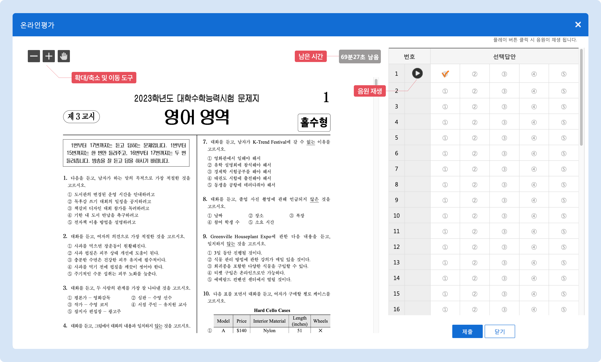
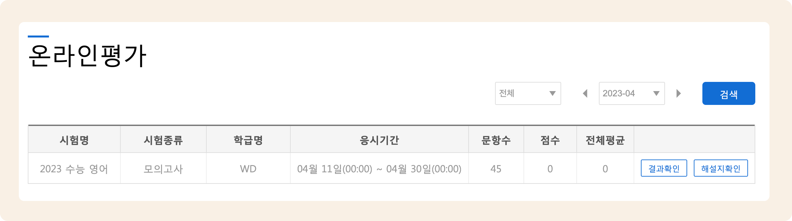

# 온라인 평가 설정

시험 기본 정보 및 문항의 세팅이 완료 되면 온라인 시험에 대한 설정을 할 수 있어요.

## 온라인 평가 설정

### 홈페이지 메뉴 설정


 기본메뉴 → 홈페이지 관리 → **홈페이지 설정**


**홈페이지 설정**의 '메뉴 및 인트로 설정'에서 **온라인 평가** 프로그램을 추가하면 학생의 아이디로 로그인 후 해당 메뉴에서 온라인 시험을 진행할 수 있습니다.

[홈페이지 설정 프로그램 상세 보기 →](../homepage/customizing/menu.md#undefined-3)

<figure><figcaption></figcaption></figure>

### 온라인 평가 세팅하기


 기본메뉴 → 수업관리 → **시험관리**


&#x20;시험 리스트에서 원하는 시험을 선택하고 <mark style="color:blue;">**온라인 평가**</mark> 탭으로 이동하여 온라인 평가 옵션을 설정합니다.

<figure><figcaption></figcaption></figure>

<table><thead><tr><th width="173">입력 항목</th><th>내용</th></tr></thead><tbody><tr><td><strong>사용 여부</strong></td><td>🔘 <strong>사용</strong> 을 선택해야 온라인 평가를 진행할 수 있어요. (시험 생성 시 기본값은 미사용 입니다)</td></tr><tr><td><strong>평가지</strong></td><td>온라인 평가에 사용할 시험지를 업로드 합니다. PDF 형식만 업로드 가능</td></tr><tr><td><strong>해설지</strong></td><td>시험 응시 완료 후 학생이 볼 수 있는 해설지를 업로드 합니다. </td></tr><tr><td><strong>응시 시작</strong></td><td>홈페이지에서 시험이 오픈 되는 시간을 지정합니다. 해당 시간 부터 온라인 시험의 응시하기 버튼이 활성화 됩니다.</td></tr><tr><td><strong>응시 종료</strong></td><td>시험이 닫히는 시간을 설정합니다. 시험 응시 중 종료 시간이 지나면 진행 중인 결과를 저장하고 제출 처리 합니다.</td></tr><tr><td>

<strong>평가 시간</strong>
</td><td>시험 진행 시간을 설정합니다. 평가 진행 화면에서 남은 시간이 표시 됩니다. 평가 시간이 끝나면 진행 중인 결과를 저장하고 최종 제출 처리됩니다.</td></tr><tr><td><strong>선다형 타입</strong></td><td>선다형의 개수는 5개만 사용할 수 있습니다. - 숫자형: 선택 답안이 <strong>숫자</strong>로 표시됩니다. - 영문형: 선택 답안이 <strong>알파벳</strong>으로 표시됩니다.</td></tr><tr><td><strong>음원 추가</strong></td><td>듣기 평가 음원(mp3 파일 형식만 가능)을 업로드합니다. 각 문항 별로 음원을 추가하거나, 특정 문항 범위의 음원을 한꺼번에 올릴 수 있습니다.</td></tr><tr><td><strong>성적 결과</strong></td><td>시험 응시 종료 후 결과 확인 시, 시험지 노출 여부를 설정합니다.</td></tr><tr><td><strong>학급</strong></td><td>시험을 응시할 학급을 추가합니다.</td></tr></tbody></table>


OMR 채점을 진행하지 않고 온라인 평가만 사용할 경우 주관식 문항을 선다형 중간에 넣을 수 있어요.


## 온라인 평가 응시


**학생**이 홈페이지에 로그인해 진행하는 화면입니다.


학원 홈페이지로 이동 하여 **로그인** 후 **온라인 평가** 프로그램이 설정된 메뉴로 이동합니다. 메뉴 명은 임의 변경이 가능하므로 학원마다 다를 수 있습니다.

### 시험 응시 전

**응시하기** 버튼을 눌러 시험을 시작할 수 있습니다.

<figure><figcaption></figcaption></figure>

### 시험 응시 화면

시험 응시 후 제출 버튼을 누르면 자동으로 성적이 처리 됩니다.

<figure><figcaption></figcaption></figure>

### 시험 종료 후

제출 완료 후 **시험 결과**와 **해설지**를 확인할 수 있습니다.&#x20;

* 온라인 평가 설정에서 **성적 결과** 옵션을 '결과만 노출'로 선택했을 시 결과 확인에서 시험지는 보이지 않습니다.
* 해설지가 업로드 되지 않으면 <mark style="color:blue;">**해설지 확인**</mark> 버튼은 나오지 않습니다.

<figure><figcaption></figcaption></figure>
