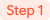
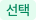
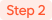

# 성적표 출력

## 1. 성적표 인쇄

 성적표를 출력할 시험과 학생을 선택합니다.


**개별 학생 상세보기**

의 **학생명** 오른쪽에 위치한:mag:를 누르면 학생 상세 정보 페이지로 이동할 수 있어요.


<figure><figcaption></figcaption></figure>

1.  섹션에서 인쇄를 원하는 시험을 선택
2. &#x20; 학급 단위로 검색을 원하는 경우  섹션에서 별도의 학급을 선택
3.  에서 성적표를 인쇄할 1명 이상의 학생을 체크
4. 를 누르면 미리보기 및 인쇄를 진행할 수 있어요.

 미리보기 및 인쇄 진행

출력할 성적표를 확인 후 인쇄를 진행합니다.&#x20;

성적표에 **색상을 표시** 하려면 인쇄 미리보기 화면에서 **(크롬) 설정 더보기** 또는 **(엣지) 기타 설정**을 눌러 :ballot\_box\_with\_check: **배경 그래픽** 을 체크해주어야 해요.

<figure><figcaption></figcaption></figure>
